# EVolocity ECU System — End-to-End Architecture

> A guided tour of how the whole system works, written for a software-engineering
> student. It covers **both repositories**:
>
> - `capstone-project-compsys-team-6-1/` — the **embedded firmware** (two ESP32
>   boards talking over ESP-NOW). The relevant code is in
>   `ESP-NOW/ESP_NOW_SENDER` (the *sender*, on the vehicle) and
>   `ESP-NOW/ESP-NOW` (the *controller*, plugged into the laptop).
> - `capstone-project-software-team-6/` — the **server + browser app**
>   (`backend/` = Python FastAPI, `frontend/` = React).
>
> Read it top-to-bottom the first time. After that, each Part stands alone.

---

## Table of contents

1. [The 30-second version](#1-the-30-second-version)
2. [Glossary](#2-glossary-read-this-first)
3. [Whole-system architecture](#3-whole-system-architecture)
4. [Part A — CompSys (firmware)](#part-a--compsys-firmware)
   - [A1. The two boards and their jobs](#a1-the-two-boards-and-their-jobs)
   - [A2. The ESP-NOW message protocol](#a2-the-esp-now-message-protocol)
   - [A3. Connection handshake](#a3-connection-handshake-hello--register--welcome)
   - [A4. The sender data pipeline](#a4-the-sender-data-pipeline-adc--browser)
   - [A5. Reliability: buffering, ACKs, flash, disconnect, sleep](#a5-reliability-buffering-acks-flash-disconnect-sleep)
   - [A6. ⭐ Deep dive: Time sync](#a6--deep-dive-time-sync)
   - [A7. ⭐ Deep dive: Setting the power limit](#a7--deep-dive-setting-the-power-limit)
   - [A8. ⭐ Deep dive: Activating the buzzer](#a8--deep-dive-activating-the-buzzer)
5. [Part B — The bridge (UART serial reader)](#part-b--the-bridge-uart-serial-reader)
6. [Part C — Backend (FastAPI)](#part-c--backend-fastapi)
   - [C1. App structure & startup](#c1-app-structure--startup)
   - [C2. The database model](#c2-the-database-model)
   - [C3. Ingest pipeline](#c3-the-ingest-pipeline)
   - [C4. WebSocket broadcast](#c4-websocket-broadcast)
   - [C5. Power-violation detection & penalties](#c5-power-violation-detection--penalties)
   - [C6. Scoring & leaderboards](#c6-scoring--leaderboards)
   - [C7. OTA firmware endpoints](#c7-ota-firmware-endpoints)
   - [C8. The REST API surface](#c8-the-rest-api-surface)
7. [Part D — Frontend (React)](#part-d--frontend-react)
8. [Part E — End-to-end walkthroughs](#part-e--end-to-end-walkthroughs)
9. [Part F — Things that surprised me (caveats & honesty)](#part-f--things-that-surprised-me-caveats--honesty)
10. [Appendix — File map](#appendix--file-map)

---

## 1. The 30-second version

EVolocity is an electric-vehicle competition. Each vehicle carries an **ECU**
(a small ESP32 board) that measures **voltage** and **current** ~100 times a
second. We want that data to show up *live* in a browser on a laptop at the
finish line, plus we want to enforce a **power limit** (a buzzer screams on the
vehicle if it cheats) and rank teams on **energy efficiency**.

The data makes this journey:

```
Vehicle ESP32 (sender)  ──ESP-NOW radio──►  Laptop ESP32 (controller)
   ──USB/UART serial──►  Python serial_reader.py  ──►  FastAPI backend
   ──SQLite (store)──    and  ──WebSocket push──►  React dashboard in browser
```

Two control signals flow **backwards** down that same pipe:

- a **time-sync** timestamp (so every board agrees what "now" is), and
- a **power limit** the user types in the browser, pushed all the way to the
  vehicle.

That's the whole system. The rest of this document explains each link in detail.

---

## 2. Glossary (read this first)

| Term | What it means here |
|------|--------------------|
| **ECU** | "Electronic Control Unit" — in this project, the ESP32 board on a vehicle that senses voltage/current. In the backend DB, an `ECU` row identified by its **MAC address**. |
| **Sender** | Firmware running on the *vehicle's* ESP32. Samples the ADC and transmits data. Lives in `ESP_NOW_SENDER/`. |
| **Controller** | Firmware running on the ESP32 *plugged into the laptop*. Receives from all senders and relays to the PC over USB. Lives in `ESP-NOW/`. |
| **ESP-NOW** | Espressif's connectionless Wi-Fi protocol. Lets ESP32s send small packets directly to each other by MAC address — no Wi-Fi router, no IP, no pairing. Think "wireless UDP between two chips." |
| **UART / serial** | The wired link between the controller ESP32 and the laptop, over the USB cable. Plain newline-delimited text/JSON at 115200 baud. |
| **Frame** | One bundle of **10 ADC samples** (10 voltage + 10 current readings) with a timestamp and a sequence `counter`. The atomic unit of data everywhere in the system. |
| **Packet** | An ESP-NOW transmission carrying **up to 3 frames** plus a 1-byte message type. |
| **MAC address** | The 6-byte hardware ID of an ESP32's Wi-Fi radio (e.g. `AA:BB:CC:DD:EE:FF`). Used as the permanent identity of each sender/ECU. |
| **`confirmed_floor`** | The highest frame counter the controller has acknowledged. The sender only needs to keep/resend frames *above* this number. This is the heart of the reliable-delivery scheme. |
| **Power limit / violation** | Competition rule: a vehicle may not exceed e.g. 350 W. The ESP32 enforces it locally (buzzer); the backend independently records violations for penalties. |
| **Energy frame** | The backend's stored representation of a frame (`energy_frames` table). |

---

## 3. Whole-system architecture

This is the master map. Everything below is a zoom-in on one box or arrow here.

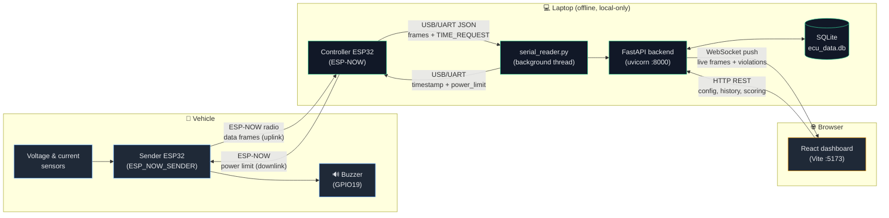
```mermaid
flowchart LR
    subgraph VEH["🚗 Vehicle"]
        SENS["Voltage & current<br/>sensors"]
        SND["Sender ESP32<br/>(ESP_NOW_SENDER)"]
        BUZ["🔊 Buzzer<br/>(GPIO19)"]
        SENS --> SND
        SND --> BUZ
    end

    subgraph LAP["💻 Laptop (offline, local-only)"]
        CTRL["Controller ESP32<br/>(ESP-NOW)"]
        SR["serial_reader.py<br/>(background thread)"]
        API["FastAPI backend<br/>(uvicorn :8000)"]
        DB[("SQLite<br/>ecu_data.db")]
        SR --> API
        API <--> DB
    end

    subgraph BROWSER["🌐 Browser"]
        UI["React dashboard<br/>(Vite :5173)"]
    end

    SND -- "ESP-NOW radio<br/>data frames (uplink)" --> CTRL
    CTRL -- "ESP-NOW<br/>power limit (downlink)" --> SND
    CTRL -- "USB/UART JSON<br/>frames + TIME_REQUEST" --> SR
    SR -- "USB/UART<br/>timestamp + power_limit" --> CTRL
    API -- "WebSocket push<br/>live frames + violations" --> UI
    UI -- "HTTP REST<br/>config, history, scoring" --> API

    classDef veh fill:#1f2937,stroke:#60a5fa,color:#e5e7eb;
    classDef lap fill:#111827,stroke:#34d399,color:#e5e7eb;
    classDef br fill:#1f2937,stroke:#f59e0b,color:#e5e7eb;
    class SENS,SND,BUZ veh;
    class CTRL,SR,API,DB lap;
    class UI br;
```

**Key idea — there are two ESP32s, not one.** Beginners often assume the vehicle
talks straight to the server. It doesn't. The vehicle's sender only knows how to
shout over the ESP-NOW radio. A *second* ESP32 (the controller) sits on the
laptop's USB port purely to catch those radio packets and re-type them as JSON
down the serial cable. The controller is a **bridge between two worlds**: wireless
ESP-NOW on one side, wired UART on the other.

> 📌 **Doc-vs-reality note:** the software repo's `README.md` describes the ESP32
> POSTing data to the server over **HTTPS**. That is *not* what the code does. The
> real transport is **ESP-NOW → UART serial**, parsed by `serial_reader.py`. An
> HTTPS `POST /api/data` endpoint *does* exist (`routers/ingest.py`) but it's a
> fallback/test path, not the live data path. This document describes the code as
> written. See [Part F](#part-f--things-that-surprised-me-caveats--honesty).

---

# Part A — CompSys (firmware)

Both firmware programs are ESP-IDF projects written in C. Confusingly, the main
source files are both still named `main/hello_world_main.c` (left over from the
ESP-IDF "hello world" template), but the contents are fully custom. They run on
**FreeRTOS**, so the code is organised as a handful of cooperating *tasks*
(lightweight threads) plus *callbacks* fired by the radio driver.

## A1. The two boards and their jobs

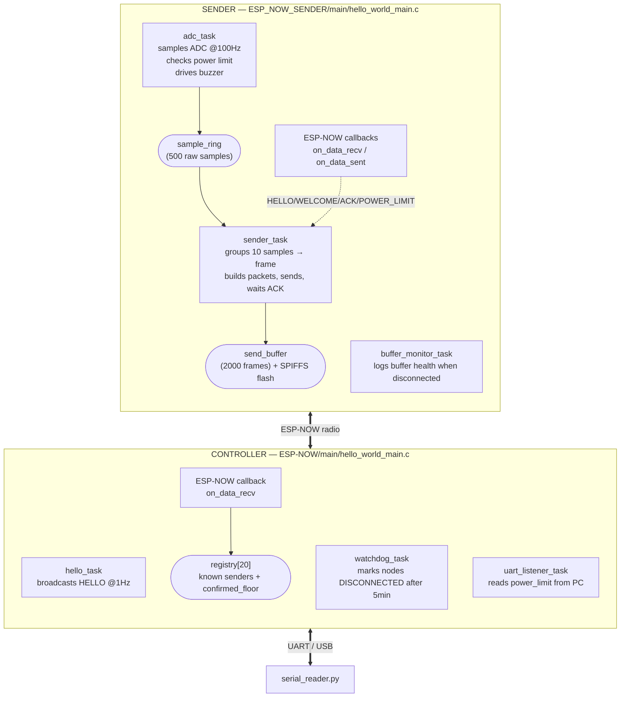
```mermaid
flowchart TB
    subgraph SENDER["SENDER  —  ESP_NOW_SENDER/main/hello_world_main.c"]
        direction TB
        s_adc["adc_task<br/>samples ADC @100Hz<br/>checks power limit<br/>drives buzzer"]
        s_snd["sender_task<br/>groups 10 samples → frame<br/>builds packets, sends, waits ACK"]
        s_buf["buffer_monitor_task<br/>logs buffer health when disconnected"]
        s_cb["ESP-NOW callbacks<br/>on_data_recv / on_data_sent"]
        s_ring(["sample_ring<br/>(500 raw samples)"])
        s_sbuf(["send_buffer<br/>(2000 frames) + SPIFFS flash"])
        s_adc --> s_ring --> s_snd --> s_sbuf
        s_cb -.HELLO/WELCOME/ACK/POWER_LIMIT.-> s_snd
    end

    subgraph CONTROLLER["CONTROLLER  —  ESP-NOW/main/hello_world_main.c"]
        direction TB
        c_hello["hello_task<br/>broadcasts HELLO @1Hz"]
        c_watch["watchdog_task<br/>marks nodes DISCONNECTED after 5min"]
        c_uart["uart_listener_task<br/>reads power_limit from PC"]
        c_cb["ESP-NOW callback<br/>on_data_recv"]
        c_reg(["registry[20]<br/>known senders + confirmed_floor"])
        c_cb --> c_reg
    end

    SENDER <== "ESP-NOW radio" ==> CONTROLLER
    CONTROLLER <== "UART / USB" ==> PC["serial_reader.py"]
```

| | **Sender** (on vehicle) | **Controller** (on laptop) |
|---|---|---|
| How many | one per vehicle (system supports up to 20) | exactly one |
| Talks to | the controller, by its MAC | all senders (broadcast) + the PC over UART |
| Reads sensors? | **yes** (ADC) | no |
| Has the buzzer? | **yes** | no |
| Keeps a data buffer? | **yes** (2000 frames + flash) | no — it relays immediately |
| Knows wall-clock time? | gets it from the controller | gets it from the PC |

## A2. The ESP-NOW message protocol

ESP-NOW just moves raw bytes. The team layered their own tiny protocol on top:
**the first byte of every packet is a message type.** Both files define the same
six constants and the same `struct` layouts (they must match exactly, byte for
byte — that's why each struct is `__attribute__((packed))`).

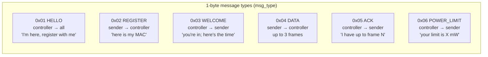
```mermaid
flowchart LR
    subgraph types["1-byte message types (msg_type)"]
        H["0x01 HELLO<br/>controller → all<br/>'I'm here, register with me'"]
        R["0x02 REGISTER<br/>sender → controller<br/>'here is my MAC'"]
        W["0x03 WELCOME<br/>controller → sender<br/>'you're in; here's the time'"]
        D["0x04 DATA<br/>sender → controller<br/>up to 3 frames"]
        A["0x05 ACK<br/>controller → sender<br/>'I have up to frame N'"]
        P["0x06 POWER_LIMIT<br/>controller → sender<br/>'your limit is X mW'"]
    end
```

The data-carrying structures (identical in both files):

```c
typedef struct {                 // one frame = 10 samples
    uint16_t counter;            // sequence number, lets us detect gaps/dupes
    int64_t  tx_epoch_us;        // UTC microseconds since 1970 (see A6 time sync)
    int16_t  current_mv[10];     // current samples
    uint32_t voltage_mv[10];     // voltage samples
} adc_frame_t;

typedef struct {                 // one packet = up to 3 frames
    uint8_t     msg_type;        // = 0x04 MSG_DATA
    uint8_t     frame_count;     // 0..3
    adc_frame_t frames[3];
} adc_packet_t;
```

> 💡 **Why bundle 3 frames per packet and 10 samples per frame?** Radio
> transmissions have fixed overhead, so sending fewer, fatter packets is more
> efficient than 100 tiny ones per second. 10 samples/frame × up to 3 frames =
> up to 30 samples per radio packet.

## A3. Connection handshake (HELLO → REGISTER → WELCOME)

Because ESP-NOW has no concept of "connecting," the firmware builds its own
discovery handshake. The controller constantly advertises itself; senders listen
and opt in.

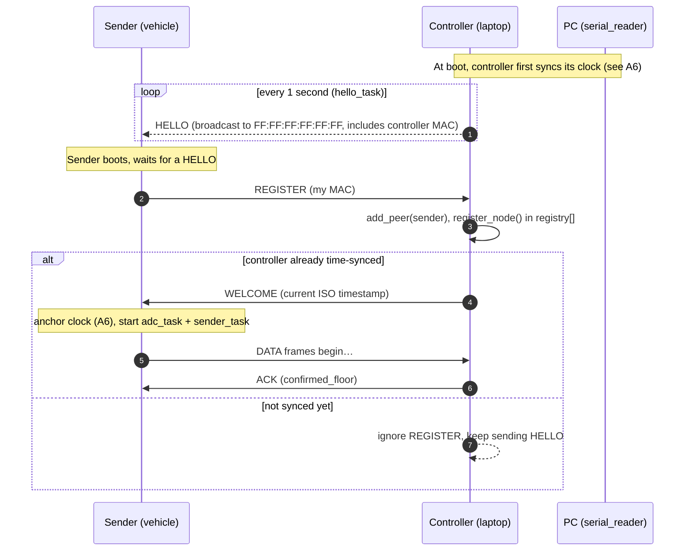
```mermaid
sequenceDiagram
    autonumber
    participant S as Sender (vehicle)
    participant C as Controller (laptop)
    participant P as PC (serial_reader)

    Note over C,P: At boot, controller first syncs its clock (see A6)
    loop every 1 second (hello_task)
        C-->>S: HELLO (broadcast to FF:FF:FF:FF:FF:FF, includes controller MAC)
    end

    Note over S: Sender boots, waits for a HELLO
    S->>C: REGISTER (my MAC)
    C->>C: add_peer(sender), register_node() in registry[]
    alt controller already time-synced
        C->>S: WELCOME (current ISO timestamp)
        Note over S: anchor clock (A6), start adc_task + sender_task
        S->>C: DATA frames begin…
        C->>S: ACK (confirmed_floor)
    else not synced yet
        C-->>C: ignore REGISTER, keep sending HELLO
    end
```

Walking the code:

- **Controller** `hello_task()` broadcasts a `HELLO` to the all-`FF` MAC every
  `HELLO_INTERVAL_MS` (1000 ms). The HELLO carries the controller's own MAC so
  the sender knows where to reply.
- **Sender** `on_data_recv()` sees `MSG_HELLO`, copies the controller MAC, adds
  it as an ESP-NOW peer, and (if not yet registered) replies with `MSG_REGISTER`.
- **Controller** `on_data_recv()` sees `MSG_REGISTER`, adds the sender as a peer,
  records it in `registry[]`, and — **only if its own clock is already
  synced** — replies with `MSG_WELCOME` containing the current timestamp.
- **Sender** receives `MSG_WELCOME`, marks itself `registered`, anchors its clock,
  and *only now* spawns `adc_task` and `sender_task`. Sampling does not begin
  until the board knows the time. Tidy.

The controller's `registry[]` (max 20 nodes) is the source of truth for "who is
connected." Each entry tracks the sender's MAC, its `confirmed_floor`,
`last_seen_us`, and a status (`WAITING` / `STREAMING` / `DISCONNECTED`).

## A4. The sender data pipeline (ADC → browser)

This is the hot path. Inside the sender, data flows through **two buffers and two
tasks** before it ever hits the radio. Decoupling sampling from sending means a
momentary radio stall never makes us miss a sample.

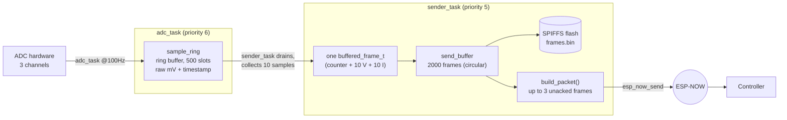
```mermaid
flowchart LR
    ADC["ADC hardware<br/>3 channels"] -->|"adc_task @100Hz"| RING

    subgraph s1["adc_task (priority 6)"]
        RING["sample_ring<br/>ring buffer, 500 slots<br/>raw mV + timestamp"]
    end

    RING -->|"sender_task drains,<br/>collects 10 samples"| FRAME["one buffered_frame_t<br/>(counter + 10 V + 10 I)"]

    subgraph s2["sender_task (priority 5)"]
        FRAME --> SBUF["send_buffer<br/>2000 frames (circular)"]
        SBUF --> FLASH[("SPIFFS flash<br/>frames.bin")]
        SBUF --> PKT["build_packet()<br/>up to 3 unacked frames"]
    end

    PKT -->|"esp_now_send"| RADIO(("ESP-NOW")) --> CTRL["Controller"]
```

Step by step (`ESP_NOW_SENDER/main/hello_world_main.c`):

1. **`adc_task`** runs every 10 ms (≈100 Hz). Each tick it reads the ADC:
   - **Current** uses *two* channels for range: it reads the low-gain channel
     first; if that exceeds `CURRENT_RANGE_SWITCH_MV` (3000 mV) it re-reads on the
     high-gain channel. This is an **auto-ranging ammeter** — fine resolution at
     low current, headroom at high current.
   - **Voltage** is read on its own channel.
   - Raw ADC counts → millivolts via ESP-IDF calibration (`adc_cali_*`), then
     board-specific linear formulas convert sensor millivolts to *real* mA / mV
     (the magic constants like `mv_c * 5.57f - 6792` are per-board calibration —
     note the commented-out "board 1" lines next to the active "board 2" ones).
   - The raw sample (current_mv, voltage_mv, timestamp) is pushed into
     `sample_ring` under `ring_mutex`.
   - It also computes instantaneous power and runs the **power-limit / buzzer**
     check (see [A8](#a8--deep-dive-activating-the-buzzer)) and the **sleep**
     check (see [A5](#a5-reliability-buffering-acks-flash-disconnect-sleep)).
2. **`sender_task`** drains `sample_ring`. Once it has collected
   `SAMPLES_PER_FRAME` (10) samples, it calls `buffer_push()` to assemble one
   `buffered_frame_t` with the next sequence `counter`, and saves it to the
   `send_buffer` (a 2000-slot circular buffer) *and* to flash.
3. It then builds a packet from up to 3 *unacknowledged* frames (those with
   counter > `confirmed_floor`) and transmits it, setting `waiting_ack = true`.

## A5. Reliability: buffering, ACKs, flash, disconnect, sleep

The marquee feature of the firmware is **lossless delivery across dropouts**. A
vehicle drives behind a building, the radio drops for a minute, and when it comes
back every frame is still delivered, in order, exactly once.

### The sliding-window ACK scheme

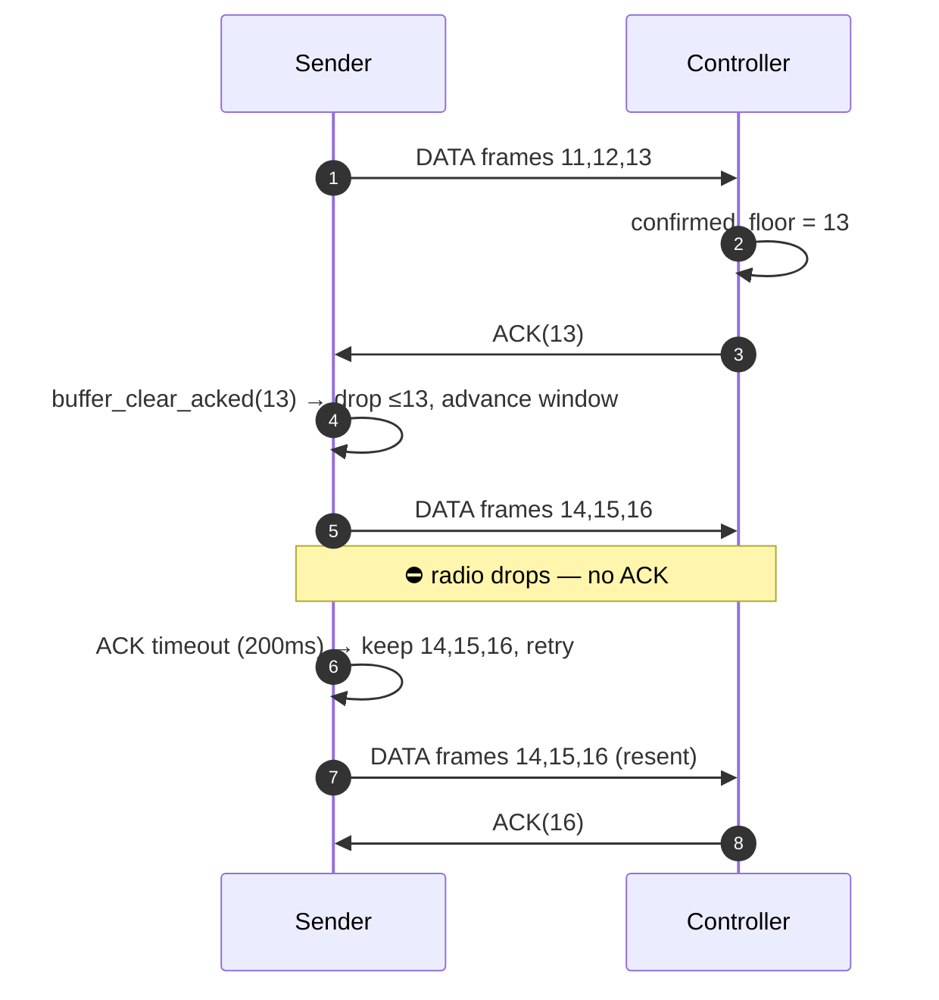
```mermaid
sequenceDiagram
    autonumber
    participant S as Sender
    participant C as Controller
    S->>C: DATA frames 11,12,13
    C->>C: confirmed_floor = 13
    C->>S: ACK(13)
    S->>S: buffer_clear_acked(13) → drop ≤13, advance window
    S->>C: DATA frames 14,15,16
    Note over S,C: ⛔ radio drops — no ACK
    S->>S: ACK timeout (200ms) → keep 14,15,16, retry
    S->>C: DATA frames 14,15,16 (resent)
    C->>S: ACK(16)
```

- The sender never deletes a frame until the controller **acknowledges** it.
  `confirmed_floor` is the high-water mark of "controller definitely has these."
- After sending, the sender sets `waiting_ack`. If no ACK arrives within
  `ACK_TIMEOUT_MS` (200 ms), or if the radio reports send failure
  (`on_data_sent` with non-success), it increments `consecutive_timeouts` and
  re-sends the same window.
- The controller's ACK simply reports the highest counter it has seen
  (`confirmed_floor`). Because frames carry monotonic counters, duplicates are
  harmless — the controller just re-acks, and the backend de-dupes by timestamp.

### Surviving a power cycle — flash persistence

Frames are also written to a 2 MB **SPIFFS flash** partition (`/spiffs/frames.bin`),
and the `confirmed_floor` / base counter are stored in **NVS**. On boot,
`flash_init()` reloads any *unconfirmed* frames back into the send buffer. So even
if the vehicle **reboots**, buffered-but-undelivered data is not lost. When
everything is acked, the file is truncated to reclaim space.

### Disconnect / reconnect detection

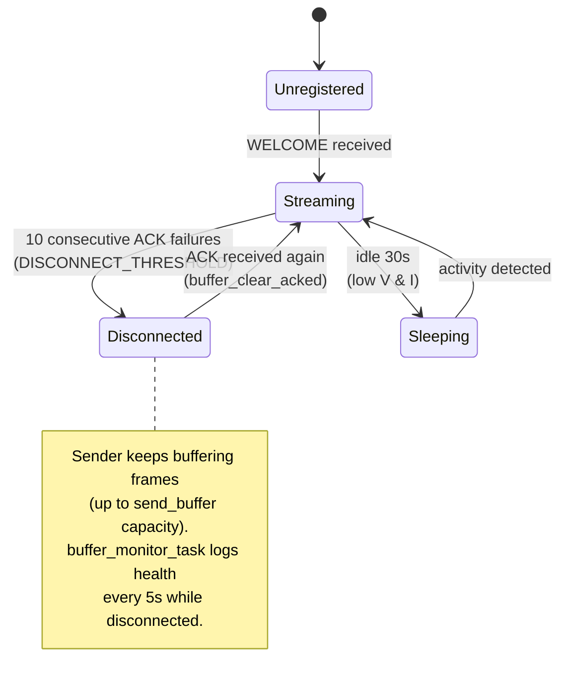
```mermaid
stateDiagram-v2
    [*] --> Unregistered
    Unregistered --> Streaming: WELCOME received
    Streaming --> Disconnected: 10 consecutive ACK failures<br/>(DISCONNECT_THRESHOLD)
    Disconnected --> Streaming: ACK received again<br/>(buffer_clear_acked)
    Streaming --> Sleeping: idle 30s<br/>(low V & I)
    Sleeping --> Streaming: activity detected
    note right of Disconnected
        Sender keeps buffering frames
        (up to send_buffer capacity).
        buffer_monitor_task logs health
        every 5s while disconnected.
    end note
```

- **Sender side:** after `DISCONNECT_THRESHOLD` (10) consecutive failures it flags
  `is_disconnected`, but **keeps sampling and buffering**. `buffer_monitor_task`
  prints buffer status every 5 s.
- **Controller side:** `watchdog_task` marks a node `DISCONNECTED` if it hasn't
  been heard from in `DISCONNECT_TIMEOUT_US` (300 s = 5 min).

### Modem sleep (power saving)

When the vehicle is parked — voltage below `SLEEP_VOLTAGE_THRESH_MV` and current
in an idle band — for 30 s, the sender calls `esp_wifi_set_ps(WIFI_PS_MIN_MODEM)`
to sleep the radio, waking every 5 s to send a tiny **heartbeat** so the
controller doesn't declare it disconnected. Any real activity instantly wakes it.

> 📎 **Two layers, two horizons.** The RAM ring (`SENDER_BUFFER_SIZE` = **2000**
> frames ≈ **3.3 min** at 10 frames/s) is the *live retransmission window* — what
> `build_packet()` resends from during a dropout. The **SPIFFS flash** log holds
> far more (~**50 min** at full resolution) and is what makes data survive a
> reboot: it's replayed into RAM by `flash_init()` at startup. So the 5-minute
> local-storage requirement is met by the flash layer; the RAM ring is
> deliberately smaller because it only needs to cover the typical short,
> frequent re-registrations of race day.

## A6. ⭐ Deep dive: Time sync

**The problem.** An ESP32 has no battery-backed real-time clock. All it has is
`esp_timer_get_time()` — microseconds **since this boot**. That's monotonic but
meaningless as wall-clock time. Yet the dashboard needs every sample stamped with
real UTC time so charts line up and out-of-order data (flushed after a
reconnection) lands in the right place. So the real time must be **injected from
the one device that knows it — the laptop** — and then propagated outward.

It's a **two-hop** sync: PC → controller (over UART), then controller → sender
(inside the WELCOME packet).

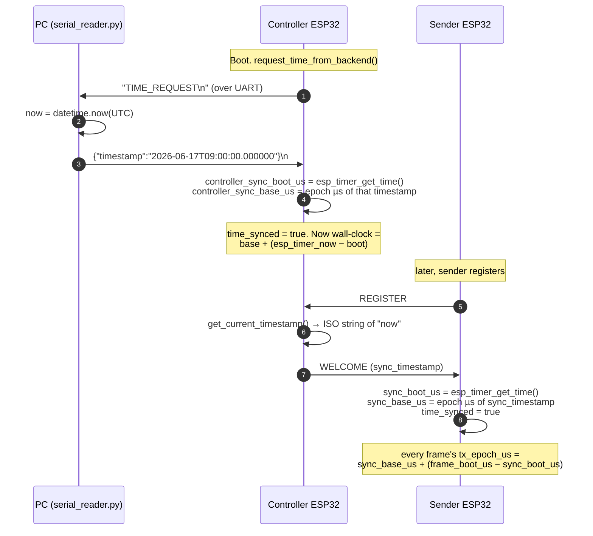
```mermaid
sequenceDiagram
    autonumber
    participant P as PC (serial_reader.py)
    participant C as Controller ESP32
    participant S as Sender ESP32

    Note over C: Boot. request_time_from_backend()
    C->>P: "TIME_REQUEST\n"  (over UART)
    P->>P: now = datetime.now(UTC)
    P->>C: {"timestamp":"2026-06-17T09:00:00.000000"}\n
    C->>C: controller_sync_boot_us = esp_timer_get_time()<br/>controller_sync_base_us = epoch µs of that timestamp
    Note over C: time_synced = true. Now wall-clock =<br/>base + (esp_timer_now − boot)

    Note over S: later, sender registers
    S->>C: REGISTER
    C->>C: get_current_timestamp() → ISO string of "now"
    C->>S: WELCOME (sync_timestamp)
    S->>S: sync_boot_us = esp_timer_get_time()<br/>sync_base_us = epoch µs of sync_timestamp<br/>time_synced = true
    Note over S: every frame's tx_epoch_us =<br/>sync_base_us + (frame_boot_us − sync_boot_us)
```

### Hop 1 — PC → controller (`request_time_from_backend`)

The controller, at boot, repeatedly writes the literal string `TIME_REQUEST\n`
over UART and waits up to 5 s for a reply. `serial_reader.py`'s `handle_time_sync`
is watching for exactly that string and answers with a JSON timestamp. The
controller parses out the ISO time, then stores **two numbers**:

- `controller_sync_boot_us` = the `esp_timer` value *at the moment of sync*.
- `controller_sync_base_us` = that wall-clock time expressed as **microseconds
  since the Unix epoch** (computed once with `strptime`/`mktime`).

From then on, "what time is it now?" is pure arithmetic — no string parsing on the
hot path:

```c
now_epoch_us = controller_sync_base_us + (esp_timer_get_time() - controller_sync_boot_us);
```

Sampling is gated on this: the controller won't even answer `REGISTER` until
`time_synced` is true.

### Hop 2 — controller → sender (inside WELCOME)

When a sender registers, the controller fills `welcome.sync_timestamp` with
`get_current_timestamp()` and sends it. The sender does the *same* trick: records
its own `sync_boot_us` and precomputes `sync_base_us`. Now the sender can convert
any boot-relative timestamp into real UTC.

### Putting a real time on each frame

Each buffered frame remembers *when it was captured* as boot-relative
`time_100ms` (boot time ÷ 100 000, i.e. tenths-of-a-second resolution to fit in
the struct). When `build_packet()` ships it, it converts to absolute UTC
microseconds:

```c
int64_t frame_boot_us = (int64_t)f->time_100ms * 100000LL;
dst->tx_epoch_us = sync_base_us + (frame_boot_us - sync_boot_us);   // real UTC µs
```

That `tx_epoch_us` rides along in the packet. The controller's `uart_send_json`
formats it into an ISO-8601 string (`get_frame_timestamp`), and that becomes the
authoritative `timestamp` the backend stores. Because the timestamp is computed
from *capture* time (not send time), frames buffered during a 1-minute outage
still carry their *original* timestamps when finally delivered — which is exactly
why the backend can insert them in the right place after the fact.

> ⚠️ **What this scheme does *not* do:** it's a one-shot anchor with no drift
> correction. The ESP32 oscillator drifts a little over time, and there's no
> periodic re-sync, so over a long session timestamps can slowly skew. For a race
> lasting minutes this is fine; for hours it would need periodic re-syncing.

## A7. ⭐ Deep dive: Setting the power limit

**Goal:** a marshal types "350" into the dashboard, and the *vehicle itself*
starts enforcing 350 W. This is the one command that travels the **entire pipe
backwards**: browser → HTTP → backend → UART → controller → ESP-NOW → sender.

```mermaid
sequenceDiagram
    autonumber
    participant U as Browser (Dashboard config form)
    participant API as FastAPI (routers/ecu.py)
    participant DB as SQLite
    participant Q as serial_reader _write_queue
    participant C as Controller ESP32
    participant S as Sender ESP32

    U->>API: POST /api/ecu/{id}/configure {power_limit_watts: 350}
    API->>DB: configure_ecu() — update ECU.power_limit_watts
    API->>Q: enqueue_power_limit(mac, 350.0)
    Note over Q: JSON line queued (thread-safe).<br/>If port down, it waits.
    API-->>U: 200 OK (updated ECU)

    loop serial read loop
        Q->>C: {"type":"power_limit","mac":"AA:..","power_limit_watts":350.0}\n
    end
    C->>C: uart_listener_task parses MAC + watts<br/>mw = watts × 1000; find node by MAC
    C->>S: ESP-NOW MSG_POWER_LIMIT {power_limit_mw: 350000}
    S->>S: power_threshold_mw = 350000<br/>(used by adc_task power check)
```

### Browser → backend

The dashboard's config form (`Dashboard.jsx`) calls
`configureEcu(id, {power_limit_watts})` → `POST /api/ecu/{id}/configure`. In
`routers/ecu.py`:

```python
@router.post("/{ecu_id}/configure", response_model=ECUResponse)
def configure_ecu_by_id(ecu_id, updates, db=Depends(get_db)):
    ecu = configure_ecu(db, ecu_id, updates)        # 1. persist to DB
    ...
    enqueue_power_limit(ecu.mac_address, ecu.power_limit_watts)  # 2. push to hardware
    return ecu
```

So the limit is both **stored** (so the backend's own violation detector and the
ESP32 agree) and **pushed** to the device.

### Backend → controller (the write queue)

`enqueue_power_limit()` doesn't touch the serial port directly — that port is
owned by a background thread. Instead it drops a JSON line onto a thread-safe
`queue.Queue` (`_write_queue`):

```python
msg = json.dumps({"type":"power_limit","mac":mac,"power_limit_watts":watts}) + "\n"
_write_queue.put(msg.encode("ascii"))
```

The serial loop drains this queue after each line it reads and writes it to the
controller. **Nice property:** if the controller is unplugged, the message simply
waits in the queue and is delivered on reconnect.

### Controller → sender

`uart_listener_task` (controller) reads UART lines, ignores anything without
`"power_limit"`, then parses the MAC and watts. It converts to **milliwatts**
(`int32_t mw = watts * 1000`), looks the sender up in `registry[]`, and forwards a
`MSG_POWER_LIMIT` packet over ESP-NOW to that specific MAC.

> 🧵 **Concurrency detail:** `uart_listener_task` is deliberately started *after*
> `request_time_from_backend()` finishes. Otherwise the time-sync reply and a
> power-limit command would race on the same UART RX buffer and corrupt each
> other. The UART **TX** side is guarded by `uart_mutex` so the JSON data stream
> and these control writes never interleave.

### Sender applies it

The sender's `on_data_recv` handles `MSG_POWER_LIMIT` by storing
`power_threshold_mw`. Until a real limit arrives, it defaults to
`DEFAULT_POWER_LIMIT_MW = 10,000,000` (10 kW) — deliberately huge so the buzzer
can never false-fire before configuration.

> 🔑 **Two independent enforcers.** The ESP32 uses the limit for the **buzzer**
> (immediate, physical, on the vehicle). The backend *separately* compares each
> incoming frame's power against the stored `ECU.power_limit_watts` to record
> **penalty events** for scoring ([C5](#c5-power-violation-detection--penalties)).
> They share the number but run independently — the buzzer works even if the
> backend is down, and penalty tracking works even if the buzzer wire is broken.

## A8. ⭐ Deep dive: Activating the buzzer

A **passive piezo buzzer** on `GPIO19` makes noise when the vehicle exceeds its
power limit. "Passive" means it needs an AC drive signal to make sound (unlike an
active buzzer that just needs DC), so the firmware drives it with a **PWM square
wave** using the ESP32's **LEDC** peripheral (normally for dimming LEDs, but a
2 kHz square wave is also an audible tone).

### Wiring it up — `buzzer_init()`

```c
ledc_timer_config_t timer = {
    .freq_hz = 2000,                 // 2 kHz tone
    .duty_resolution = LEDC_TIMER_10_BIT,   // duty range 0..1023
    ...
};
ledc_channel_config_t channel = { .gpio_num = GPIO_NUM_19, .duty = 0, ... };
```

`buzzer_set(on)` toggles the tone by switching duty between **512 (50 % → loud)**
and **0 (silent)**:

```c
ledc_set_duty(..., on ? 512 : 0);
ledc_update_duty(...);
```

### When does it fire? — inside `adc_task`

Every 10 ms, after reading the sensors, the task computes power and checks the
limit:

```c
int32_t power_mw = (real_voltage_mv * real_current_ma) / 1000;
if ((power_mw > power_threshold_mw) || (real_current_ma > 33000)) {
    if (!over_power_flag) { over_power_flag = true; over_power_start_ms = now; }
} else {
    if (over_power_flag) { over_power_flag = false; buzzer_set(false); }  // all-clear
}
```

So a breach is either **power over the configured limit** *or* an absolute
**33 A** over-current safety trip, whichever comes first.

### The beep pattern — escalating alarm

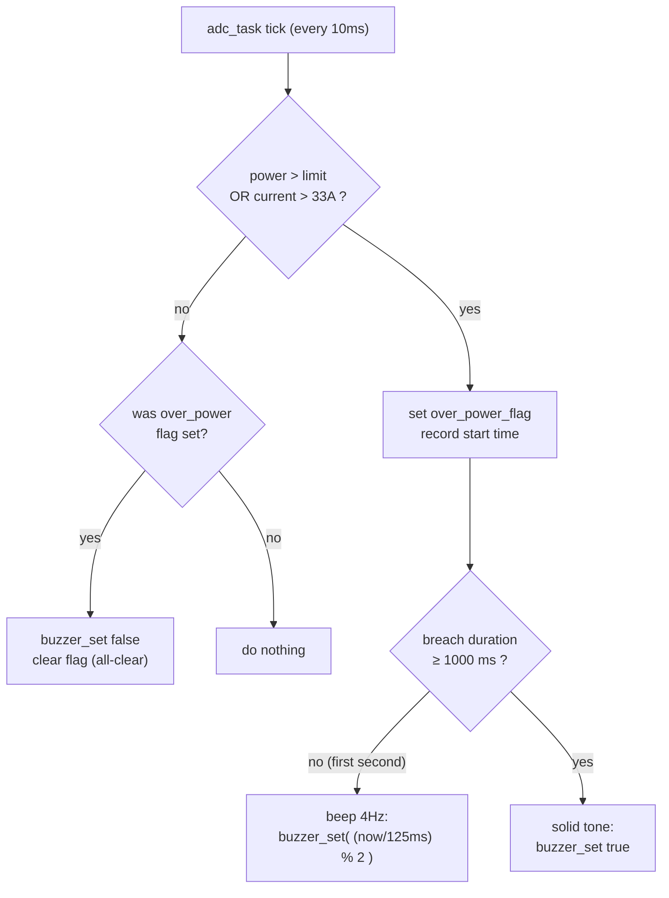
```mermaid
flowchart TD
    A["adc_task tick (every 10ms)"] --> B{"power > limit<br/>OR current > 33A ?"}
    B -- "no" --> C{"was over_power<br/>flag set?"}
    C -- "yes" --> D["buzzer_set false<br/>clear flag (all-clear)"]
    C -- "no" --> E["do nothing"]
    B -- "yes" --> F["set over_power_flag<br/>record start time"]
    F --> G{"breach duration<br/>≥ 1000 ms ?"}
    G -- "no (first second)" --> H["beep 4Hz:<br/>buzzer_set( (now/125ms) % 2 )"]
    G -- "yes" --> I["solid tone:<br/>buzzer_set true"]
```

```c
if (over_power_flag) {
    int64_t breach_ms = now - over_power_start_ms;
    if (breach_ms >= 1000) buzzer_set(true);                       // continuous after 1s
    else                   buzzer_set((now / BUZZER_BEEP_HALF_MS) % 2);  // 4Hz beep first
}
```

`BUZZER_BEEP_HALF_MS` is 125 ms, so `(now / 125) % 2` flips on/off every 125 ms →
a **4 Hz beep** for the first second (a polite "hey, watch it"), then a **solid
tone** if the breach persists (a less-polite "you're being penalised"). This
mirrors the backend's own *warning → confirmed violation* escalation, so the
audible alarm and the on-screen alert tell the same story.

> 🐛 **Minor code smell worth knowing about:** in `adc_task` there's a line
> `if (mv_v < 200) { mv_v = 0; }` that reads `mv_v` *before* the voltage ADC read
> assigns it — i.e. it tests an uninitialised value. It doesn't affect the buzzer
> logic (voltage is re-read immediately after), but it's the kind of thing a code
> review should catch. Mentioned for honesty, not as a central concern.

---

# Part B — The bridge (UART serial reader)

`backend/serial_reader.py` is the seam between firmware and software. It runs as a
**background asyncio task** inside the FastAPI process (started in `main.py`'s
`lifespan` if `SERIAL_PORT` is configured). Architecturally it's a classic
**producer/consumer with a thread boundary**, because `pyserial` is blocking and
must not block the async event loop.

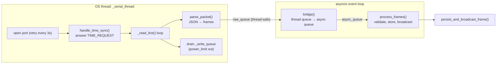
```mermaid
flowchart LR
    subgraph thread["OS thread: _serial_thread"]
        OPEN["open port (retry every 3s)"]
        TS["handle_time_sync()<br/>answer TIME_REQUEST"]
        READ["_read_line() loop"]
        PARSE["parse_packet()<br/>JSON → frames"]
        WQ["drain _write_queue<br/>(power_limit out)"]
        OPEN --> TS --> READ --> PARSE
        READ --> WQ
    end

    PARSE -->|"raw_queue (thread-safe)"| BR

    subgraph loop["asyncio event loop"]
        BR["bridge()<br/>thread queue → async queue"]
        PROC["process_frames()<br/>validate, store, broadcast"]
        BR -->|"async_queue"| PROC
    end

    PROC --> ING["persist_and_broadcast_frame()"]
```

What it does, in order:

1. **Open the port**, retrying every 3 s until the controller is plugged in.
   `setRTS(False)/setDTR(False)` prevent the act of opening the port from
   resetting the ESP32.
2. **Time sync:** `handle_time_sync()` waits for `TIME_REQUEST` and replies with
   the current UTC timestamp (the PC end of [A6](#a6--deep-dive-time-sync)). It
   also handles a stray `TIME_REQUEST` mid-stream inside the main loop.
3. **Read JSON lines.** Each line from the controller looks like:
   ```json
   {"mac":"AA:BB:CC:DD:EE:FF","rx_time_ms":12345,"frames":[
     {"counter":42,"tx_time_ms":"2026-06-17T09:00:00.000000",
      "voltage":[48210,48190,...],"current":[12500,12480,...]}]}
   ```
4. **`parse_packet()`** validates structure and **converts units**: the firmware
   sends millivolts/milliamps as integers, so it divides by 1000 to get volts and
   amps (`c/1000`, `v/1000`). It rejects packets with too many frames.
5. Each frame is pushed onto a plain `queue.Queue` (`raw_queue`). The async
   `bridge()` coroutine moves items from that thread-safe queue onto an
   `asyncio.Queue` via `run_in_executor`, so the blocking read never touches the
   loop.
6. **`process_frames()`** consumes the async queue: parses `tx_time_ms` into a
   `datetime`, builds an `EnergyFrameIngest`, computes power samples, and calls
   `persist_and_broadcast_frame()` — the same function the HTTP `/data` endpoint
   uses. From here the data is in backend territory.
7. After each read it **drains `_write_queue`**, writing any queued
   `power_limit` commands back to the controller (the PC end of
   [A7](#a7--deep-dive-setting-the-power-limit)).

> The reader is resilient: any exception closes the port and the outer
> `while True` reopens and re-syncs. Unplugging the controller mid-race is a
> non-event.

---

# Part C — Backend (FastAPI)

**Stack:** FastAPI + Uvicorn (web), SQLAlchemy 2.0 ORM + SQLite (storage),
Pydantic (validation). Everything runs on one local laptop, offline.

The codebase follows a clean **layered** structure — a pattern worth internalising:

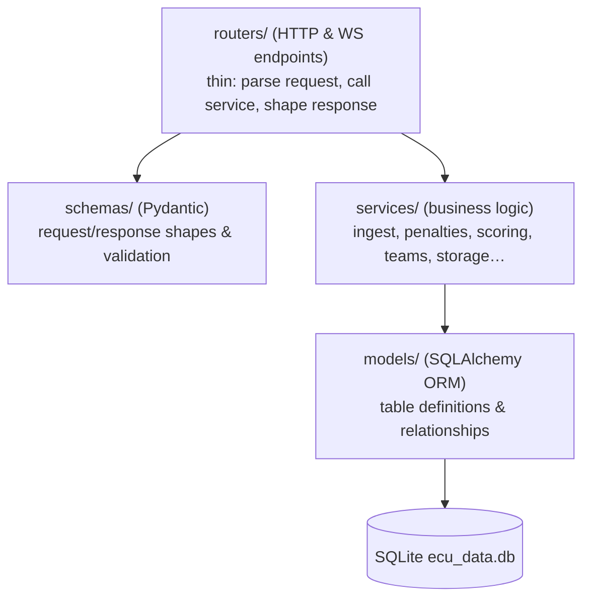
```mermaid
flowchart TB
    R["routers/ (HTTP & WS endpoints)<br/>thin: parse request, call service, shape response"]
    SCH["schemas/ (Pydantic)<br/>request/response shapes & validation"]
    SVC["services/ (business logic)<br/>ingest, penalties, scoring, teams, storage…"]
    MOD["models/ (SQLAlchemy ORM)<br/>table definitions & relationships"]
    DB[("SQLite ecu_data.db")]
    R --> SCH
    R --> SVC
    SVC --> MOD
    MOD --> DB
```

The golden rule: **routers stay thin, services hold the logic, models map to
tables, schemas guard the boundary.** A route handler should read like a sentence.

## C1. App structure & startup

`main.py` builds the app in `create_app()`:

- Registers every router under `/api` (except the WebSocket router, which is
  mounted at the root so its paths are `/ws/...`).
- Configures **CORS** to allow the Vite dev server origin (`localhost:5173`).
- A `lifespan` context manager runs at startup: `init_db()` creates all tables,
  and if `SERIAL_PORT` is set it launches `serial_reader.run()` as a background
  task. No serial port configured → the backend still runs (great for tests and
  for the HTTP/simulator path).
- Config comes from `app/config.py` (Pydantic `BaseSettings`, reads `.env`):
  `HOST`, `PORT`, `DATABASE_URL`, optional `TLS_CERT_PATH`/`TLS_KEY_PATH` (TLS is
  optional), `ALLOWED_ORIGINS`, `SERIAL_PORT`, `SERIAL_BAUD`.

## C2. The database model

Seven tables. The center of gravity is `ECU` (a physical board) and `EnergyFrame`
(its readings). Everything else organises ECUs into teams, competitions, events
(`Competition` → `CompetitionEvent` → `EventParticipant`), and tracks violations.

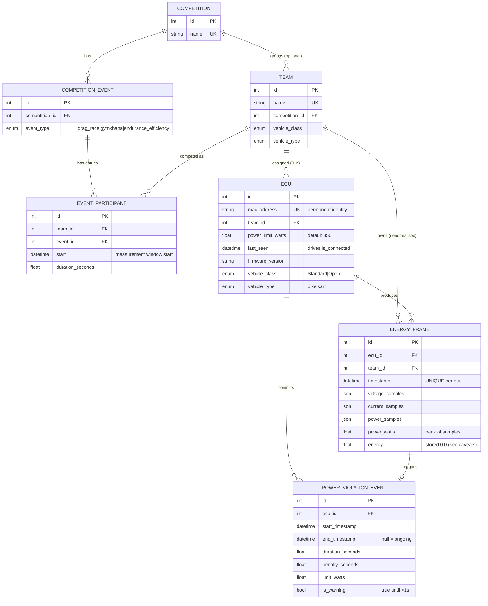
```mermaid
erDiagram
    COMPETITION ||--o{ COMPETITION_EVENT : has
    COMPETITION ||--o{ TEAM : "groups (optional)"
    COMPETITION_EVENT ||--o{ EVENT_PARTICIPANT : "has entries"
    TEAM ||--o{ EVENT_PARTICIPANT : "competes as"
    TEAM ||--o{ ECU : "assigned (0..n)"
    TEAM ||--o{ ENERGY_FRAME : "owns (denormalised)"
    ECU ||--o{ ENERGY_FRAME : produces
    ECU ||--o{ POWER_VIOLATION_EVENT : commits
    ENERGY_FRAME ||--o| POWER_VIOLATION_EVENT : "triggers"

    ECU {
        int id PK
        string mac_address UK "permanent identity"
        int team_id FK
        float power_limit_watts "default 350"
        datetime last_seen "drives is_connected"
        string firmware_version
        enum vehicle_class "Standard|Open"
        enum vehicle_type "bike|kart"
    }
    ENERGY_FRAME {
        int id PK
        int ecu_id FK
        int team_id FK
        datetime timestamp "UNIQUE per ecu"
        json voltage_samples
        json current_samples
        json power_samples
        float power_watts "peak of samples"
        float energy "stored 0.0 (see caveats)"
    }
    POWER_VIOLATION_EVENT {
        int id PK
        int ecu_id FK
        datetime start_timestamp
        datetime end_timestamp "null = ongoing"
        float duration_seconds
        float penalty_seconds
        float limit_watts
        bool is_warning "true until >1s"
    }
    TEAM {
        int id PK
        string name UK
        int competition_id FK
        enum vehicle_class
        enum vehicle_type
    }
    COMPETITION {
        int id PK
        string name UK
    }
    COMPETITION_EVENT {
        int id PK
        int competition_id FK
        enum event_type "drag_race|gymkhana|endurance_efficiency"
    }
    EVENT_PARTICIPANT {
        int id PK
        int team_id FK
        int event_id FK
        datetime start "measurement window start"
        float duration_seconds
    }
```

A few design points worth noticing as a student:

- **`mac_address` is the natural key** for an ECU — it's how a board is recognised
  across reboots. The integer `id` is just a convenient surrogate.
- **`(ecu_id, timestamp)` is UNIQUE** on `energy_frames`. This single constraint
  is what makes ingestion **idempotent**: re-delivered frames (from the ESP32's
  retry logic) can't create duplicate rows.
- `ECU.is_connected` is a **computed property**, not a column: it's `True` if
  `last_seen` is within `CONNECTION_TIMEOUT_SECONDS` (10 s) of now. Connection
  status is *derived* from data freshness, not stored.
- `team_id` is denormalised onto `energy_frame` so per-team queries are cheap.
- Foreign keys use thoughtful cascade rules (`CASCADE` for frames when an ECU is
  deleted; `SET NULL` for team links) and there are `CHECK` constraints (e.g.
  `power_limit_watts > 0`).

## C3. The ingest pipeline

One function, `services/ingest.py::persist_and_broadcast_frame`, is the single
choke-point every reading flows through — whether it arrived via serial or HTTP.

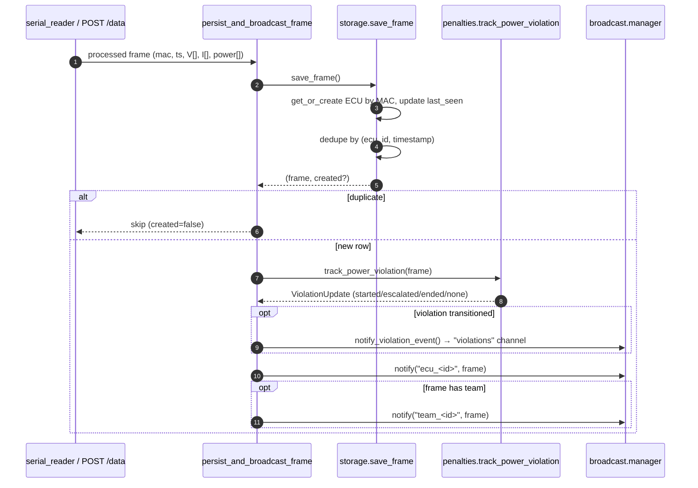
```mermaid
sequenceDiagram
    autonumber
    participant SR as serial_reader / POST /data
    participant ING as persist_and_broadcast_frame
    participant ST as storage.save_frame
    participant PEN as penalties.track_power_violation
    participant WS as broadcast.manager
    SR->>ING: processed frame (mac, ts, V[], I[], power[])
    ING->>ST: save_frame()
    ST->>ST: get_or_create ECU by MAC, update last_seen
    ST->>ST: dedupe by (ecu_id, timestamp)
    ST-->>ING: (frame, created?)
    alt duplicate
        ING-->>SR: skip (created=false)
    else new row
        ING->>PEN: track_power_violation(frame)
        PEN-->>ING: ViolationUpdate (started/escalated/ended/none)
        opt violation transitioned
            ING->>WS: notify_violation_event() → "violations" channel
        end
        ING->>WS: notify("ecu_<id>", frame)
        opt frame has team
            ING->>WS: notify("team_<id>", frame)
        end
    end
```

Important behaviours:

- **Auto-registration:** `save_frame` calls `_get_or_create_ecu_by_mac`. The first
  time an unknown board's data arrives, an `ECU` row is created on the fly. You
  never have to pre-register hardware.
- **`last_seen` is bumped on every frame**, which is what later makes
  `is_connected` go true.
- `power_watts` is stored as the **peak** of the per-sample power; `power_samples`
  is `V×I` per sample (`processing.compute_power_samples`).

## C4. WebSocket broadcast

`services/broadcast.py` is a small **pub/sub** hub: a `ConnectionManager` holding
sets of sockets keyed by **channel name**. Routers in `routers/websocket.py`
expose three channels:

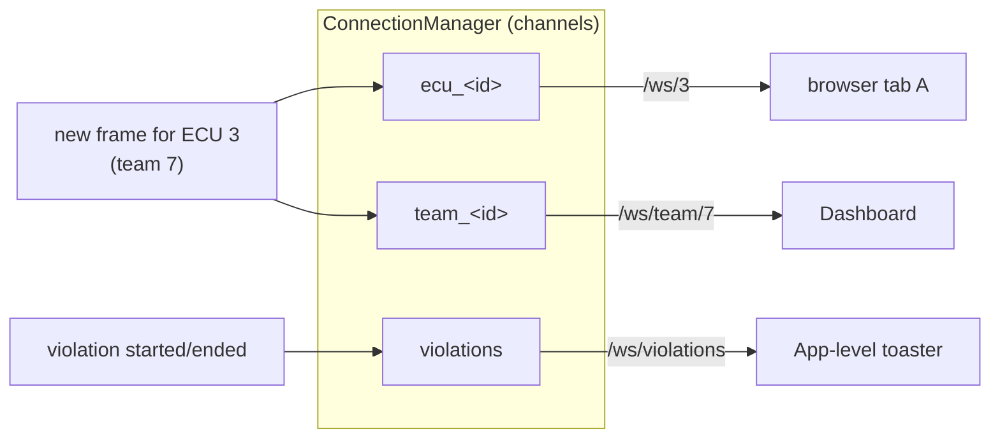
```mermaid
flowchart LR
    subgraph backend["ConnectionManager (channels)"]
        EC["ecu_&lt;id&gt;"]
        TM["team_&lt;id&gt;"]
        VI["violations"]
    end
    F1["new frame for ECU 3<br/>(team 7)"] --> EC
    F1 --> TM
    V1["violation started/ended"] --> VI

    EC -->|"/ws/3"| B1["browser tab A"]
    TM -->|"/ws/team/7"| B2["Dashboard"]
    VI -->|"/ws/violations"| B3["App-level toaster"]
```

- `/ws/{ecu_id}` → channel `ecu_<id>` — frames for one board.
- `/ws/team/{team_id}` → channel `team_<id>` — frames for any ECU on a team (what
  the Dashboard actually subscribes to).
- `/ws/violations` → channel `violations` — power-violation lifecycle events,
  consumed app-wide for toast notifications.

These are **server-push, receive-only** channels: the client never sends anything
(the server loops on `receive_text()` only to detect disconnect). `notify()`
serialises the message to every subscriber and silently drops dead sockets.

## C5. Power-violation detection & penalties

This is the *software* half of the power-limit story (the *hardware* half is the
buzzer, [A8](#a8--deep-dive-activating-the-buzzer)). `services/penalties.py`
treats a violation as a **stateful episode** with a lifecycle, not a one-off flag.

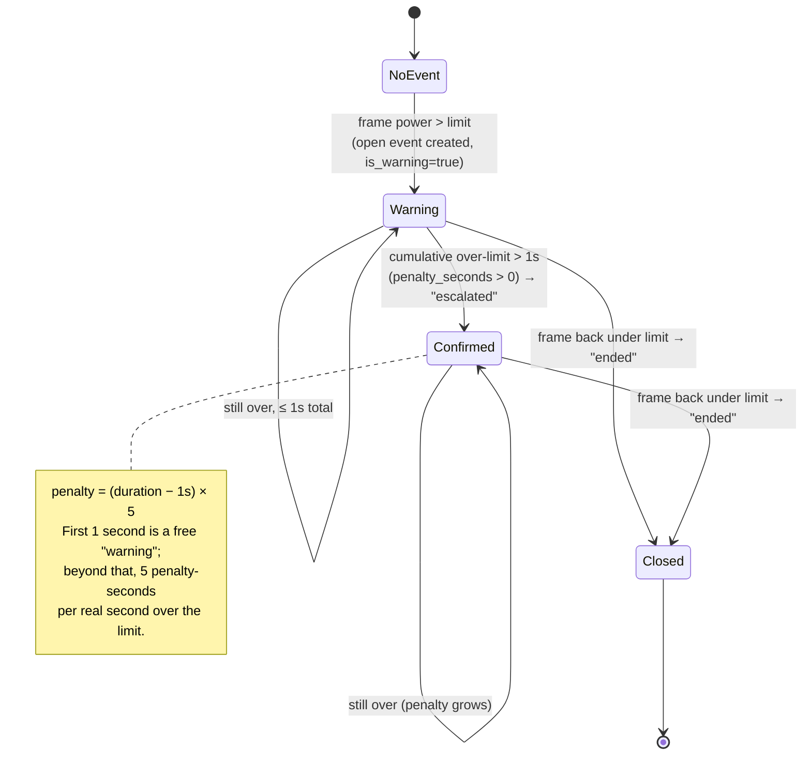
```mermaid
stateDiagram-v2
    [*] --> NoEvent
    NoEvent --> Warning: frame power > limit<br/>(open event created, is_warning=true)
    Warning --> Warning: still over, ≤ 1s total
    Warning --> Confirmed: cumulative over-limit > 1s<br/>(penalty_seconds > 0) → "escalated"
    Confirmed --> Confirmed: still over (penalty grows)
    Warning --> Closed: frame back under limit → "ended"
    Confirmed --> Closed: frame back under limit → "ended"
    Closed --> [*]
    note right of Confirmed
        penalty = (duration − 1s) × 5
        First 1 second is a free "warning";
        beyond that, 5 penalty-seconds
        per real second over the limit.
    end note
```

For each new frame, `track_power_violation`:

1. Looks up the ECU's `power_limit_watts` and compares it to the frame's
   `power_watts` (peak).
2. If **over** and no event is open → create one (`transition="started"`,
   `is_warning=true`).
3. If **over** and an event is open → extend it: bump `frame_count`, advance
   `last_over_timestamp`, raise `peak_power_watts`, recompute `duration_seconds`
   and `penalty_seconds`. If it crosses the 1-second threshold for the first time,
   `transition="escalated"` (warning → real penalty).
4. If **under** and an event is open → close it (`end_timestamp`,
   `transition="ended"`).
5. Out-of-order non-breach frames are ignored so they can't close an active event
   prematurely — important because the ESP32 may deliver buffered frames late.

Only `started` / `escalated` / `ended` transitions are pushed over the
`violations` WebSocket; the frontend turns those into toasts and the notification
log. Closed events are queryable via `GET /api/violations`.

## C6. Scoring & leaderboards

`services/scoring.py` answers "who's the most **energy-efficient**?" (lower energy
for the run = better). Two entry points:

- **`compute_event_leaderboard`** (`GET /api/scoring/event-leaderboard/{event_id}`)
  — the leaderboard the UI polls every 5 s. For each `EventParticipant` it picks a
  **measurement window**:
  - `start` + `duration` set → fixed window, capped at 30 s (stable ranking);
  - `start` only → `[start, now]`, capped at 1 h (live, updates each poll);
  - no `start` → **pending**, unranked.

  It integrates energy over that window and ranks ascending (ties share a rank).
- **`score_event_from_energy`** (`GET /api/scoring/event/{event_id}`) — a more
  general scorer that buckets ECUs into **brackets** by `(vehicle_class,
  vehicle_type)` and produces an interpolated 25–100 score per bracket, with
  selectable metric (energy / avg power / elapsed) and energy source.

**Energy is computed by trapezoidal integration of V×I over time**
(`_integrated_energy_wh`) — the same maths the frontend does live. This matters
because the stored `EnergyFrame.energy` column is `0.0`, so the *integrated* energy
source is the meaningful one (see caveats).

## C7. OTA firmware endpoints

`routers/firmware.py` implements the *server side* of over-the-air updates:

- `POST /api/{ecu_id}/firmware` — upload a `.bin`. It validates extension,
  content-type, size (≤ 8 MB), and the **ESP32 image magic byte `0xE9`**, computes
  a SHA-256, stores the file, and records an in-memory job (`PENDING`).
- `GET /api/{ecu_id}/firmware/download` — the device fetches the image.
- `POST /api/{ecu_id}/firmware/status` — the device reports progress; on
  `SUCCESS` the ECU's `firmware_version` is updated and old files cleaned up.
- `GET /api/{ecu_id}/firmware/status` — the UI polls this for a progress bar.

> ⚠️ This is **server-side scaffolding**. Job state lives in a plain in-memory
> dict (lost on restart), and — importantly — **the two ESP-NOW firmware files in
> this repo (`ESP_NOW_SENDER`, `ESP-NOW`) contain no OTA client code.** The
> endpoints, the `FirmwareUpdate.jsx` page, and the device-side flashing are not
> wired together in the code provided here. Treat OTA as designed-and-stubbed, not
> end-to-end working.

## C8. The REST API surface

| Method & path | Purpose |
|---|---|
| `POST /api/data` | HTTP ingest fallback (mirrors the serial path) |
| `GET /api/ecu/` | list all ECUs (+ `is_connected`) |
| `GET /api/ecu/{id}` | one ECU's config & status |
| `POST /api/ecu/{id}/configure` | update settings **+ push power limit to device** |
| `GET /api/ecu/{id}/history` | stored frames (filter by time / `before` / limit) |
| `GET /api/teams/`, `POST /api/teams/` | team CRUD |
| `POST /api/teams/{id}/assign/{ecu_id}` | bind an ECU to a team |
| `GET /api/teams/{id}/frames` | team frames (optionally within an event window) |
| `GET/POST /api/competitions/...` | competitions & their teams |
| `…/event-participants/…` | per-team event entries (start time + duration) |
| `GET /api/scoring/event-leaderboard/{id}` | efficiency leaderboard |
| `GET /api/violations/` | power-violation history |
| `…/firmware/…` | OTA upload/download/status |
| `WS /ws/{ecu_id}`, `/ws/team/{id}`, `/ws/violations` | live push channels |

---

# Part D — Frontend (React)

**Stack:** React 18 + Vite, **Recharts** for graphs, **react-toastify** for
notifications. Plain CSS. No router library — navigation is driven by component
state in `App.jsx`.

## D1. Navigation model

The app is a drill-down. `App.jsx` holds the selection state and renders different
content based on how deep you've navigated:

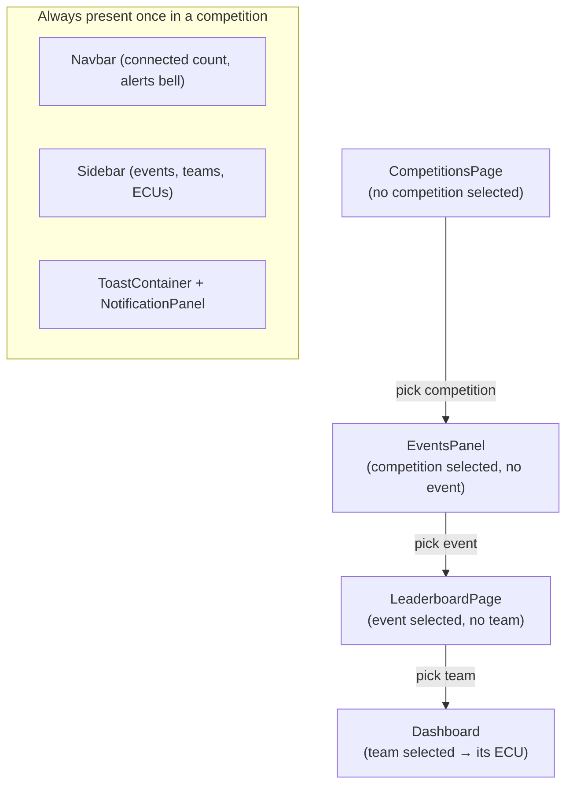
```mermaid
flowchart TD
    CP["CompetitionsPage<br/>(no competition selected)"] -->|pick competition| EV
    EV["EventsPanel<br/>(competition selected, no event)"] -->|pick event| LB
    LB["LeaderboardPage<br/>(event selected, no team)"] -->|pick team| DSH
    DSH["Dashboard<br/>(team selected → its ECU)"]

    subgraph chrome["Always present once in a competition"]
        NAV["Navbar (connected count, alerts bell)"]
        SIDE["Sidebar (events, teams, ECUs)"]
        TOAST["ToastContainer + NotificationPanel"]
    end
```

`App.jsx` also owns cross-cutting concerns: it opens the **violations WebSocket**
once for the whole app (`useViolationsWebSocket`) and turns events into toasts; it
polls open violations every 2 s to put a red dot on offending team cards; it polls
the ECU list every 10 s; and it manages dark/light theme.

## D2. The API & WebSocket layers

- `src/api/http.js` — a thin `fetch` wrapper (`request()`) plus one named function
  per endpoint (`fetchEcus`, `configureEcu`, `fetchEventLeaderboard`, …). Base URL
  hardcoded to `http://localhost:8000/api`.
- `src/api/websocket.js` — a `WebSocketClient` class wrapping the browser
  `WebSocket` with JSON parsing and **auto-reconnect with backoff** (5 attempts,
  3 s apart).
- `src/hooks/useWebSocket.js` — React hooks wrapping that client:
  - `useTeamWebSocket(teamId)` → subscribes to `/ws/team/{id}`, returns
    `{isConnected, liveData}`. **This is what the Dashboard uses.**
  - `useViolationsWebSocket(onEvent)` → app-level violation stream, with its own
    *infinite* reconnect so alerts are never lost across a backend restart.
  - `useMultiTeamWebSockets(teamIds)` → one socket per team for multi-team views
    (used by the leaderboard overview), carefully opening/closing sockets as the
    ID set changes without breaking the rules of hooks.

## D3. The Dashboard — live data flow

`pages/Dashboard.jsx` is the most data-intensive component. It blends three data
sources for one ECU: a REST seed of recent history, a live WebSocket stream, and
on-demand history paging.

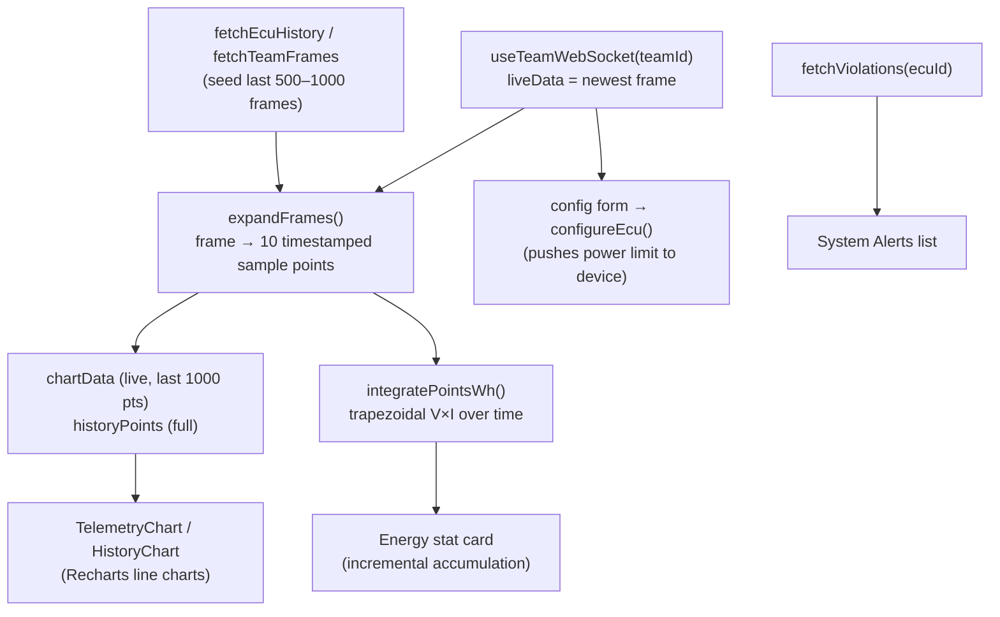
```mermaid
flowchart TD
    WS["useTeamWebSocket(teamId)<br/>liveData = newest frame"] --> EXP
    REST["fetchEcuHistory / fetchTeamFrames<br/>(seed last 500–1000 frames)"] --> EXP
    EXP["expandFrames()<br/>frame → 10 timestamped sample points"] --> CHART
    EXP --> ENERGY

    CHART["chartData (live, last 1000 pts)<br/>historyPoints (full)"] --> RECHARTS["TelemetryChart / HistoryChart<br/>(Recharts line charts)"]
    ENERGY["integratePointsWh()<br/>trapezoidal V×I over time"] --> STAT["Energy stat card<br/>(incremental accumulation)"]

    WS --> CFG["config form → configureEcu()<br/>(pushes power limit to device)"]
    REST2["fetchViolations(ecuId)"] --> ALERTS["System Alerts list"]
```

Things worth calling out for a student reading the code:

- **Frame → points expansion.** Each frame carries 10 samples but one timestamp.
  `expandSingleFrame` spreads the 10 samples evenly across the gap from the
  previous frame's time, so the chart shows ~100 points/s, not 10.
- **UTC handling.** The backend emits timestamps *without* a `Z`. `ensureUtc()`
  appends one so the browser doesn't misread them as local time — a classic,
  easy-to-miss bug the code defends against.
- **Incremental energy.** Rather than re-integrating all history on every frame
  (O(n) each tick), it integrates only the new delta and adds to a running total —
  O(samples-per-frame) per update.
- **Connection truth.** `isConnected` from the hook only means "the WebSocket to
  the backend is open." Whether the *physical ECU* is live is
  `ecuData.is_connected` (backend's 10-s freshness), with a 15-s grace based on the
  last live frame so a stale poll can't flash the dot red mid-stream.
- **Config form** = the UI end of [A7](#a7--deep-dive-setting-the-power-limit):
  changing the power limit here pushes it all the way to the vehicle.

> `Settings.jsx` and `FirmwareUpdate.jsx` are present but currently **only contain
> header comments describing intended behaviour** — they're placeholders. The live
> config UI lives inside the Dashboard.

---

# Part E — End-to-end walkthroughs

These tie all the parts together. If you only remember three sequences, remember
these.

### E1. A single reading, sensor → screen

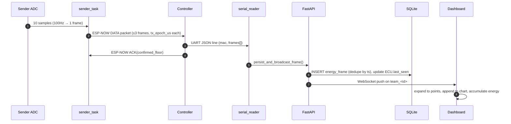
```mermaid
sequenceDiagram
    autonumber
    participant ADC as Sender ADC
    participant SND as sender_task
    participant CTL as Controller
    participant SR as serial_reader
    participant API as FastAPI
    participant DB as SQLite
    participant UI as Dashboard

    ADC->>SND: 10 samples (100Hz → 1 frame)
    SND->>CTL: ESP-NOW DATA packet (≤3 frames, tx_epoch_us each)
    CTL->>SR: UART JSON line (mac, frames[])
    CTL->>SND: ESP-NOW ACK(confirmed_floor)
    SR->>API: persist_and_broadcast_frame()
    API->>DB: INSERT energy_frame (dedupe by ts), update ECU.last_seen
    API->>UI: WebSocket push on team_<id>
    UI->>UI: expand to points, append to chart, accumulate energy
```

### E2. Setting a power limit, screen → vehicle

(Full sequence in [A7](#a7--deep-dive-setting-the-power-limit).) In one line:
**Dashboard form → `POST /configure` → DB + `_write_queue` → UART →
`uart_listener_task` → ESP-NOW `MSG_POWER_LIMIT` → `power_threshold_mw`.**

### E3. A power breach, two alarms at once

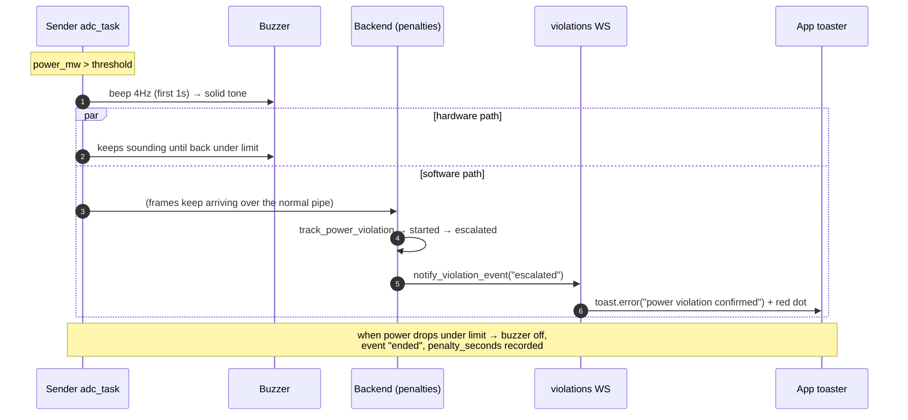
```mermaid
sequenceDiagram
    autonumber
    participant ADC as Sender adc_task
    participant BUZ as Buzzer
    participant API as Backend (penalties)
    participant WS as violations WS
    participant UI as App toaster

    Note over ADC: power_mw > threshold
    ADC->>BUZ: beep 4Hz (first 1s) → solid tone
    par hardware path
        ADC->>BUZ: keeps sounding until back under limit
    and software path
        ADC->>API: (frames keep arriving over the normal pipe)
        API->>API: track_power_violation → started → escalated
        API->>WS: notify_violation_event("escalated")
        WS->>UI: toast.error("power violation confirmed") + red dot
    end
    Note over ADC,UI: when power drops under limit → buzzer off,<br/>event "ended", penalty_seconds recorded
```

The breach lights up **two independent systems**: the vehicle's buzzer (instant,
local, works offline) and the dashboard's alert/penalty pipeline (needs the data
to reach the backend). They agree because they share the same limit value, but
neither depends on the other.

---

# Part F — Things that surprised me (caveats & honesty)

A good architecture doc tells you where the map and the territory differ. None of
these are blockers — they're the kind of notes you'd want before relying on the
system or demoing it.

1. **Transport is ESP-NOW + UART, not HTTPS.** The software README's "HTTPS POST
   from ESP32" diagram describes an aspirational design. The working data path is
   ESP-NOW → controller → UART → `serial_reader.py`. The `POST /api/data` endpoint
   exists but isn't the live path.
2. **`EnergyFrame.energy` is always stored as `0.0`.** Real energy is computed by
   integration — live in the Dashboard, and on demand in scoring. So any scoring
   path using the `TRANSMITTED` energy source yields zero; the `INTEGRATED_POWER`
   source is the meaningful one, and the event leaderboard uses integration
   directly.
3. **Two buffer horizons.** The RAM ring is ~3.3 min (the live retransmission
   window); the SPIFFS flash log (~50 min) is what satisfies the 5-minute
   local-storage requirement and survives reboots. Worth knowing which layer
   covers which failure: RAM for short live dropouts, flash for reboots and long
   outages.
4. **Time sync is one-shot, no drift correction.** Fine for a short race; would
   skew over hours without periodic re-sync.
5. **OTA is server/UI scaffolding only.** No OTA client exists in the two ESP-NOW
   firmware projects here, and job state is in-memory.
6. **`Settings.jsx` / `FirmwareUpdate.jsx` are comment-only placeholders.** Live
   config happens in the Dashboard.
7. **Minor firmware bug:** `adc_task` tests `mv_v` before it's assigned (harmless
   in practice; see [A8](#a8--deep-dive-activating-the-buzzer)).
8. **Hardcoded localhost URLs** in `http.js`/`useWebSocket.js` ignore the provided
   `.env` (`VITE_API_URL`, `VITE_WS_URL`) — fine for the single-laptop deployment,
   worth wiring up before moving hosts.

---

# Appendix — File map

### CompSys firmware (`capstone-project-compsys-team-6-1/`)

| Path | What it is |
|------|-----------|
| `ESP-NOW/ESP_NOW_SENDER/main/hello_world_main.c` | **Sender** firmware (vehicle): ADC, buffering, flash, buzzer, ESP-NOW TX |
| `ESP-NOW/ESP-NOW/main/hello_world_main.c` | **Controller** firmware (laptop): HELLO/ACK, registry, UART JSON, time sync, power-limit relay |
| `Task1_ADC/` | Standalone ADC experiment (precursor to the sender's ADC code) |
| `LTSPICE/`, `ProjectResource/` | Circuit simulation, datasheets, specs |

### Software (`capstone-project-software-team-6/`)

| Path | What it is |
|------|-----------|
| `backend/main.py` | FastAPI app factory, router registration, serial-reader launch |
| `backend/serial_reader.py` | **The bridge**: UART ↔ backend, time sync, power-limit out |
| `backend/app/config.py`, `database.py` | settings; SQLAlchemy engine/session/`init_db` |
| `backend/app/models/` | ORM tables (`ecu`, `energy_frame`, `team`, `competition`, `event_participant`, `power_violation_event`) |
| `backend/app/services/` | logic: `ingest`, `storage`, `processing`, `penalties`, `scoring`, `teams`, `broadcast` |
| `backend/app/routers/` | endpoints: `ingest`, `ecu`, `teams`, `competitions`, `event_participants`, `scoring`, `violations`, `firmware`, `websocket` |
| `backend/app/schemas/` | Pydantic request/response models |
| `backend/simulate_esp32*.py` | scripts that fake ESP32 data over HTTP (for dev without hardware) |
| `frontend/src/App.jsx` | top-level state, navigation, global violation toasts |
| `frontend/src/pages/Dashboard.jsx` | live charts, stats, config form, alerts |
| `frontend/src/pages/LeaderboardPage.jsx` | efficiency leaderboard |
| `frontend/src/api/http.js`, `api/websocket.js` | REST wrapper; WebSocket client |
| `frontend/src/hooks/` | `useWebSocket`, `useMultiTeamWebSockets` |
| `frontend/src/components/` | charts, panels, modals, navbar, sidebar |

---

*Generated as a study aid. Where this document and a source file disagree, the
source file wins — it's the ground truth, and parts of the system are still
evolving.*
