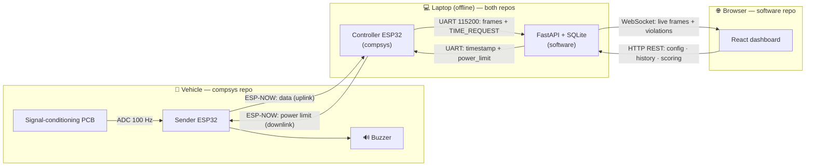

https://youtu.be/Fb5tEijWFxg

# EVolocity ECU Telemetry System — Team 6

A prototype **Energy Control Unit (ECU)** system for
[EVolocity](https://www.evolocity.co.nz/), a New Zealand STEM programme where
school students design, build, and race electric vehicles. This project replaces
EVolocity's manual, USB-C, plug-into-every-vehicle data-retrieval process with a
**fully wireless telemetry system** that streams each vehicle's energy data to a
live browser dashboard on the event operator's laptop — with no internet
connection or cloud services.

It adds **bidirectional current sensing** (so energy recovered through
regenerative braking is scored fairly), **live power-limit alerts**, and an
**energy-efficiency leaderboard**, all running locally at zero ongoing software
cost.

> This folder is an **umbrella** over two independent Git repositories. Start here
> for the big picture, then dive into whichever repo you need.

---

## The two repositories

| Repository | What it contains | Stack |
|-----------|------------------|-------|
| [**compsys-team**](./compsys-team/README.md) | ESP32 firmware (sender + controller) and electrical / PCB design | C · ESP-IDF · FreeRTOS · ESP-NOW · Altium · LTspice |
| [**software-team**](./software-team/README.md) | FastAPI backend, SQLite database, and React dashboard | Python 3.12 · FastAPI · SQLAlchemy · React 18 · Vite |

📖 **[`ARCHITECTURE.md`](./ARCHITECTURE.md)** — the full, diagram-rich walkthrough
of how everything works end to end (read this for the deep dives on time sync, the
power limit, the buzzer, ingest, scoring, and the frontend).

---

## How it fits together

Data flows from the vehicle's battery terminals all the way to a browser, and two
control signals (time sync and power limit) flow back the other way.



**In words:** a **sender** ESP32 on each vehicle samples voltage and current at
100 Hz and transmits over the connectionless **ESP-NOW** radio protocol. A single
**controller** ESP32 on the laptop's USB port receives from all senders and
re-emits the data as JSON over **UART serial**. A Python **serial reader** feeds
those frames into a **FastAPI** backend, which stores them in **SQLite** and
pushes them live to a **React** dashboard over **WebSockets**. Configuration and
history travel back over a REST API, and a power-limit change is pushed all the
way down to the vehicle.

See [`ARCHITECTURE.md`](./ARCHITECTURE.md) for the detailed diagrams.

---

## Repository layout

```text
capstone/
├── README.md                          ← you are here (umbrella overview)
├── ARCHITECTURE.md                    ← full end-to-end technical walkthrough
│
├── compsys-team/
│   ├── ESP-NOW/ESP_NOW_SENDER/        Sender firmware (on each vehicle)
│   ├── ESP-NOW/ESP-NOW/               Controller firmware (on the laptop)
│   ├── Task1_ADC/                     Early ADC experiment
│   ├── LTSPICE/                       Circuit simulations
│   └── ProjectResource/               Datasheets, Altium files, spec, lectures
│
└── software-team/
    ├── backend/                       FastAPI + serial reader + SQLite
    └── frontend/                      React + Vite dashboard
```

---

## Quick start

Each repo has full step-by-step instructions in its own README; here is the order
to bring the whole system up.

1. **Firmware** — flash the controller and sender ESP32s (see the
   [compsys README](./compsys-team/README.md#getting-started--build--flash)).
2. **Backend** — start FastAPI with `SERIAL_PORT` set to the controller's serial
   port (see the
   [software README](./software-team/README.md#1-backend)).
3. **Controller** — plug it in; it time-syncs with the backend over UART.
4. **Senders** — power the vehicle ECUs; they register and begin streaming.
5. **Frontend** — `npm run dev` and open <http://localhost:5173>.

No hardware? Run the backend without `SERIAL_PORT` and use the
`simulate_esp32*.py` scripts to generate fake ECU data.

---

## Key facts

- **Measurement:** 18–60 V battery voltage, ±100 A bidirectional current, sampled
  at 100 Hz, validated within **±2.5 %** of bench reference and **≤ ±0.5 %**
  unit-to-unit.
- **Reliability:** two-layer buffering (2000-frame RAM ring + SPIFFS flash) with a
  sliding-window ACK scheme, so no data is lost across radio dropouts or reboots.
- **Local-first:** all data stays on the operator's laptop over a UART link and
  localhost — no cloud, no internet dependency, supporting NZ data-sovereignty
  requirements.
- **Radio:** ESP-NOW on 2.4 GHz, operating under NZ's General User Radio Licence
  (no individual licence required for prototype use).
- **Cost:** ≈ **$29.97 NZD** per ECU (custom PCB + ESP32 DevKitC); $0 ongoing
  software cost.

---

## Documentation index

- [`ARCHITECTURE.md`](./ARCHITECTURE.md) — end-to-end technical walkthrough with
  diagrams.
- [compsys README](./compsys-team/README.md) — firmware &
  electrical: build, flash, calibration, ESP-NOW protocol.
- [software README](./software-team/README.md) — backend &
  frontend: setup, API, features, CI.

