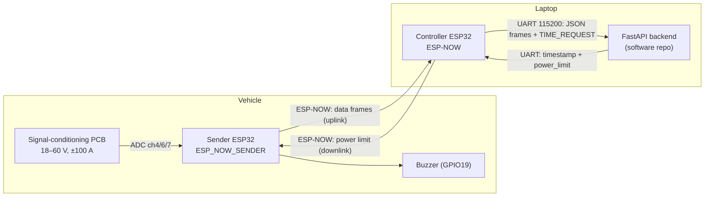
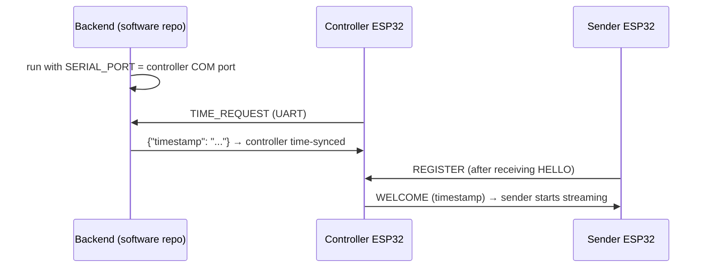

[](https://classroom.github.com/a/HaPkH0Dv)

# EVolocity ECU — Computer Systems & Electrical

Embedded firmware and electrical design for the EVolocity Energy Control Unit
(ECU) — a wireless telemetry system that measures a race vehicle's battery
**voltage** and **bidirectional current** at 100 Hz and streams it to a laptop
over a custom ESP-NOW radio protocol.

This repository holds the **Computer Systems** (ESP32 firmware) and
**Electrical** (PCB / circuit) work. The browser dashboard and server that
consume this data live in the separate **software** repository
(`capstone-project-software-team-6`). A full end-to-end walkthrough of both
repositories — with diagrams — is in the top-level `ARCHITECTURE.md` that sits
alongside both repos.

---

## What's in this repository

| Path | Contents |
|------|----------|
| `ESP-NOW/ESP_NOW_SENDER/` | **Sender firmware** — runs on each *vehicle* ESP32. Samples the ADC, buffers data, transmits over ESP-NOW, drives the buzzer. |
| `ESP-NOW/ESP-NOW/` | **Controller firmware** — runs on the *laptop-side* ESP32. Receives from all senders, relays to the PC over UART, and forwards downlink commands. |
| `Task1_ADC/` | Early standalone ADC one-shot experiment (precursor to the sender's sampling code). |
| `LTSPICE/` | LTspice circuit simulations for the voltage / current signal-conditioning stages. |
| `ProjectResource/` | Datasheets, Altium library/template, client specification, and lecture material. |

> The two `main/hello_world_main.c` filenames are left over from the ESP-IDF
> project template; their contents are fully custom (sender / controller firmware).

---

## The two-board architecture

There are **two ESP32s**, not one. The vehicle's sender only speaks the ESP-NOW
radio protocol; a second ESP32 on the laptop's USB port (the controller) catches
those radio packets and re-emits them as JSON over the serial cable. The
controller is a **bridge between two worlds** — wireless ESP-NOW on one side,
wired UART on the other.



Using two devices avoids making each ECU run a full Wi-Fi/IP stack, which keeps
transmission latency low and removes network-association delays.

### Sender vs controller at a glance

| | **Sender** (`ESP_NOW_SENDER`) | **Controller** (`ESP-NOW`) |
|---|---|---|
| Runs on | each vehicle ECU | the one board on the laptop USB |
| Reads sensors (ADC) | ✅ | ❌ |
| Drives the buzzer | ✅ | ❌ |
| Buffers data (RAM + flash) | ✅ | ❌ (relays immediately) |
| Talks to the PC over UART | ❌ | ✅ |
| FreeRTOS tasks | `adc_task`, `sender_task`, `buffer_monitor_task` | `hello_task`, `watchdog_task`, `uart_listener_task` |

---

## Firmware feature highlights

- **100 Hz ADC sampling** on ADC Unit 1 with 12 dB attenuation (12-bit,
  ~150–2450 mV effective range). Raw counts are corrected by the ESP-IDF
  calibration framework, then a per-board linear stage converts to real
  milliamps / millivolts.
- **Dual-range current sensing** — the low-range channel (ch7) is read first; if
  it exceeds 3000 mV (~10 A) the high-range channel (ch4) is used instead. This
  preserves resolution at low current while still capturing high-current spikes.
- **Two-layer buffering for lossless delivery** — every frame goes into a
  2000-frame circular **RAM** buffer *and* is appended to a 2 MB **SPIFFS flash**
  partition. A sliding-window ACK scheme (`confirmed_floor`) means the sender
  only keeps and re-sends unacknowledged frames. On reboot, unacknowledged frames
  are restored from flash so data survives an unexpected power loss.
- **Self-healing disconnect / reconnect** — after 10 consecutive send failures or
  ACK timeouts (200 ms) the sender marks itself disconnected but keeps sampling
  and buffering; it re-registers on the next controller `HELLO` and drains its
  backlog automatically.
- **Power-saving mode** — when the vehicle is idle (voltage < 200 mV and current
  in a small dead-band) for 30 s, the radio enters `WIFI_PS_MIN_MODEM` while the
  ADC keeps running; a heartbeat every 5 s keeps the controller's registry entry
  alive.
- **Time synchronisation** (the team-designed CompSys feature) — real UTC time is
  injected from the laptop and propagated to every ECU so buffered frames keep
  correct timestamps even after a disconnection. See below.
- **On-device power-limit buzzer** — an immediate audible alarm on the vehicle
  when it exceeds its configured power limit.

### Time synchronisation (two-hop)

The ESP32 has no real-time clock, so wall-clock time is injected from the one
device that knows it — the laptop — and propagated outward:

1. **PC → controller (UART).** On boot the controller writes `TIME_REQUEST` over
   UART and blocks until the backend replies with a UTC timestamp. It stores the
   `esp_timer` value at that instant plus the epoch time, so "now" becomes
   `base + (esp_timer_now − boot)`.
2. **Controller → sender (ESP-NOW).** Every `WELCOME` packet carries the current
   timestamp. A sender anchors its own monotonic clock to it on registration.
3. Each frame records the boot-timer value at the moment of sampling; the UTC
   timestamp is reconstructed when the packet is built. Frames buffered during an
   outage therefore keep their **original capture time** when finally delivered.

### Power limit & buzzer

The power limit set in the dashboard travels the whole pipe backwards
(browser → HTTP → backend → UART → controller → ESP-NOW → sender) and is stored
in `power_threshold_mw`. In `adc_task`, if instantaneous power exceeds that
threshold (or current exceeds a 33 A hard limit), the passive buzzer on
**GPIO19** is driven by an LEDC PWM square wave at 2 kHz: it **beeps at 4 Hz for
the first second**, then holds a **continuous tone** while the breach persists,
and goes silent once power returns under the limit.

---

## Hardware summary

| Item | Value |
|------|-------|
| Microcontroller | ESP32 DevKitC (ESP32-WROOM-32E) |
| Voltage range | 18–60 V (resistive divider + buffer + RC filter) |
| Current range | ±100 A bidirectional (low-side shunt, offset to ADC mid-scale) |
| ADC | Unit 1 — ch4 = high-range current, ch6 = voltage, ch7 = low-range current |
| ADC config | 12 dB attenuation, 12-bit |
| Buzzer | Passive, GPIO19, LEDC PWM @ 2 kHz |
| UART (controller ↔ PC) | UART0, 115200 baud, 8-N-1 |
| Radio | ESP-NOW on 2.4 GHz (no Wi-Fi association / IP stack) |
| Accuracy (validated) | within ±2.5 % of bench reference; ≤ ±0.5 % unit-to-unit |

Two prototype PCBs (referred to as the *red* and *green* boards) were fabricated.
Calibration-select jumpers let the firmware identify which board it is running on
and apply the correct per-unit constants.

---

## Getting started — build & flash

### Prerequisites

- **ESP-IDF v5.4 or newer** (the ESP-NOW callback signatures used require a recent
  v5.x). Follow the
  [ESP-IDF getting-started guide](https://docs.espressif.com/projects/esp-idf/en/stable/esp32/get-started/index.html)
  to install the toolchain and export the environment (`. $HOME/esp/esp-idf/export.sh`,
  or `export.ps1` on Windows PowerShell).
- Two ESP32 DevKitC boards (one controller, one or more senders) and their USB
  cables.

### Flash the controller

```bash
cd ESP-NOW/ESP-NOW
idf.py set-target esp32
idf.py build
idf.py -p <CONTROLLER_PORT> flash monitor      # e.g. -p COM5  (Windows) or -p /dev/ttyUSB0 (Linux)
```

### Flash each sender

```bash
cd ESP-NOW/ESP_NOW_SENDER
idf.py set-target esp32
idf.py build
idf.py -p <SENDER_PORT> flash monitor
```

> `idf.py monitor` opens the serial port for debugging. During normal operation
> the **backend owns the controller's serial port** (it reads frames and answers
> `TIME_REQUEST`), so don't run `monitor` on the controller port at the same time
> as the backend.

### Bring-up order

Because the controller needs the current time from the backend before it will
admit senders, start things in this order:



1. Start the **backend** (see the software repo's README) with `SERIAL_PORT` set
   to the controller's port.
2. Plug in / power the **controller** — it syncs time over UART.
3. Power on the **sender** ECU(s) — they register and begin streaming.
4. Start the **frontend** and open the dashboard.

### Configuration & calibration

- **Per-board calibration constants** live in
  `ESP-NOW/ESP_NOW_SENDER/main/hello_world_main.c` (the linear conversion
  formulas in `adc_task` / `sender_task`). The "board 2" constants are active;
  the "board 1" equivalents are commented alongside them — switch as needed for
  your unit.
- **Pin / channel / threshold** definitions are the `#define`s at the top of each
  `main/hello_world_main.c` (ADC channels, `BUZZER_GPIO`, `SENDER_BUFFER_SIZE`,
  `ACK_TIMEOUT_MS`, `MAX_NODES`, etc.).
- The sender uses a SPIFFS partition — see
  `ESP-NOW/ESP_NOW_SENDER/partitions.csv` and `sdkconfig.defaults`.

---

## ESP-NOW message protocol (quick reference)

The first byte of every ESP-NOW packet is a message type. Both firmware files
define the same six types and identical `__attribute__((packed))` structs — they
must match byte-for-byte.

| Type | Value | Direction | Purpose |
|------|-------|-----------|---------|
| `MSG_HELLO` | `0x01` | controller → all | discovery broadcast (every 1 s) |
| `MSG_REGISTER` | `0x02` | sender → controller | request to join (sends MAC) |
| `MSG_WELCOME` | `0x03` | controller → sender | admits node, carries sync timestamp |
| `MSG_DATA` | `0x04` | sender → controller | up to 3 frames (10 V + 10 I samples each) |
| `MSG_ACK` | `0x05` | controller → sender | acknowledges up to `confirmed_floor` |
| `MSG_POWER_LIMIT` | `0x06` | controller → sender | delivers the power limit (mW) |

---

## Roadmap

Planned work beyond the current prototype (see `ARCHITECTURE.md` and the team
report for detail):

- **On-device OTA firmware updates** — the server-side OTA infrastructure exists
  in the software repo; the ESP32-side receive-and-flash logic is not yet built.
  It needs an OTA partition layout and chunked delivery over the serial/ESP-NOW
  link (the ECUs have no direct IP path to the download endpoint).
- **Adaptive storage-aware sampling** — reduce the sample rate as flash fills to
  extend retention past 4.5 h within the same partition.
- **Outdoor range validation** — tested at ~10–15 m in the lab; ESP-NOW is
  expected to reach 200–400 m line-of-sight and should be validated on a real
  course, potentially with a higher-gain controller antenna.
- **Hardware RTC (e.g. DS3231)** — a battery-backed clock to hold accurate time
  through long disconnections without relying on the server-issued timestamp.

---

## Related documentation

- **`ARCHITECTURE.md`** (top level, alongside both repos) — full system
  walkthrough with sequence and state diagrams, including deep dives on time
  sync, the power limit, and the buzzer.
- **`software-team`** — the FastAPI backend and React
  dashboard that consume this firmware's data.
