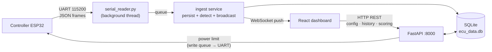

# EVolocity ECU Dashboard — Software

[](https://classroom.github.com/a/IjV0HRak)

Browser-based, real-time dashboard for the EVolocity Energy Control Unit (ECU)
wireless telemetry system. The system collects battery **voltage**, **current**,
and **power** data from ESP32-based ECUs on EVolocity race vehicles and displays
it live in a browser — running entirely on a **local Windows laptop** with no
internet connection or cloud services.

This is the **software** component. The ESP32 firmware and electrical design live
in the companion **compsys** repository (`capstone-project-compsys-team-6-1`). A
full end-to-end walkthrough of both repositories — with diagrams — is in the
top-level `ARCHITECTURE.md` alongside both repos.

---

## Project overview

Each vehicle carries an ECU that samples voltage and current at 100 Hz. This
software system:

- **Ingests energy frames** arriving from the ESP32 controller over a USB/UART
  serial link (parsed by `serial_reader.py`).
- **Stores** every reading in a local SQLite database, keyed by the ECU-reported
  timestamp, so data flushed out of order after a reconnection is stored
  correctly.
- **Broadcasts** new readings to connected browsers in real time over WebSockets.
- Provides a browser dashboard where event administrators can:
  - Create and manage **competitions**, **teams**, and **events**.
  - View **live and historical** voltage / current / power per team and ECU.
  - See **power-limit breach** notifications (warning → penalty) in real time.
  - **Configure** each ECU (team number, vehicle class/type, power limit) — and
    have the power limit pushed back down to the physical ECU.
  - Track an **energy-efficiency leaderboard** and a **multi-team comparison**
    view across all vehicles at once.

> **Note on transport.** Data reaches this backend over **ESP-NOW → UART serial**
> (via the controller ESP32), *not* over Wi-Fi/HTTPS — a deliberate choice given
> EVolocity's no-internet requirement. An HTTP `POST /api/data` endpoint also
> exists and mirrors the same ingest path; it is used by the simulators and as a
> fallback.

---

## Tech stack

| Layer | Technology |
|-------|------------|
| Backend server | **Python 3.12 + FastAPI** (async, REST + WebSocket) |
| Data persistence | **SQLite + SQLAlchemy 2.0** |
| Data validation | **Pydantic** |
| Serial bridge | **pyserial** (background thread → asyncio queue) |
| Frontend framework | **React 18 + Vite** |
| Charting | **Recharts** |
| Notifications | **react-toastify** |
| Live transport | **WebSocket** (server push) |

All dependencies are free for commercial use (see `SBOM.md`). SQLite keeps all
data on the operator's machine; migrate to PostgreSQL if the system is scaled.

---

## Communication flow



### Message shapes

**Serial packet (controller → `serial_reader.py`), one JSON line per packet:**

```json
{
  "mac": "AA:BB:CC:DD:EE:FF",
  "rx_time_ms": 123456,
  "frames": [
    {
      "counter": 42,
      "tx_time_ms": "2026-06-17T09:00:00.000000",
      "voltage": [48210, 48190, 48205],
      "current": [12500, 12480, 12510]
    }
  ]
}
```
(voltage/current are integer millivolts / milliamps — divided by 1000 on ingest.)

**Live frame pushed to the browser over WebSocket (`EnergyFrameResponse`):**

```json
{
  "id": 1001,
  "ecu_id": 3,
  "timestamp": "2026-06-17T09:00:00.000000",
  "voltage_samples": [48.21, 48.19, 48.20],
  "current_samples": [12.50, 12.48, 12.51],
  "power_samples": [602.6, 601.4, 603.4],
  "energy": 0.0
}
```

**Power-limit downlink (backend → controller over UART):**

```json
{"type": "power_limit", "mac": "AA:BB:CC:DD:EE:FF", "power_limit_watts": 350.0}
```

---

## Features

| # | Feature | Where |
|---|---------|-------|
| 1 | Team & competition management | `routers/teams.py`, `routers/competitions.py` |
| 2 | Historical race data per team | `GET /api/teams/{id}/frames`, `GET /api/ecu/{id}/history` |
| 3 | Live telemetry (voltage / current / power) | WebSocket channels + `Dashboard.jsx` |
| 4 | Power-limit breach detection & alerts | `services/penalties.py`, `/ws/violations` |
| 5 | Energy-efficiency leaderboard | `services/scoring.py`, `LeaderboardPage.jsx` |
| 6 | **Multi-team comparison dashboard** (team-designed) | `AllTeamsOverview.jsx`, `useMultiTeamWebSockets.js` |

Power-limit detection runs in **two independent places**: the ESP32 sounds a
local buzzer immediately, while the backend re-evaluates every frame to create
persistent violation records and penalty times. Breaches ≤ 1 s are *warnings*
(yellow); beyond 1 s they become *penalties* (red), matching the EVolocity
rulebook.

---

## Project structure

```text
capstone-project-software-team-6/
├── README.md
├── SBOM.md                          Software bill of materials
│
├── backend/                         Python + FastAPI server
│   ├── main.py                      App factory; registers routers, CORS, starts serial reader
│   ├── serial_reader.py             UART bridge: reads frames, answers time sync, sends power limits
│   ├── simulate_esp32*.py           Fake-ECU scripts (POST frames without hardware)
│   ├── requirements.txt
│   ├── .env.example
│   └── app/
│       ├── config.py                Pydantic settings (reads .env)
│       ├── database.py              SQLAlchemy engine, session, init_db()
│       ├── models/                  ORM tables: ecu, energy_frame, team, competition,
│       │                            event_participant, power_violation_event
│       ├── schemas/                 Pydantic request/response models
│       ├── services/                Business logic:
│       │   ├── ingest.py            persist_and_broadcast_frame() — the ingest choke-point
│       │   ├── storage.py           DB access (ECUs, frames, get-or-create by MAC)
│       │   ├── processing.py        power = V × I per sample
│       │   ├── penalties.py         power-violation lifecycle state machine
│       │   ├── scoring.py           efficiency leaderboard / bracket scoring
│       │   ├── broadcast.py         WebSocket ConnectionManager (pub/sub by channel)
│       │   ├── teams.py, competitions.py, event_participants.py
│       └── routers/                 HTTP + WebSocket endpoints:
│           ├── ingest.py            POST /api/data (HTTP fallback)
│           ├── ecu.py              ECU list/detail/configure/history
│           ├── teams.py, competitions.py, event_participants.py
│           ├── scoring.py, violations.py, firmware.py
│           └── websocket.py         /ws/{ecu_id}, /ws/team/{id}, /ws/violations
│   └── tests/                       pytest suite (in-memory SQLite, httpx ASGI client)
│
└── frontend/                        React browser app (Vite)
    ├── index.html, package.json, vite.config.js, .env.example
    └── src/
        ├── main.jsx, App.jsx        Root; state-driven navigation + global violation toasts
        ├── api/
        │   ├── http.js              REST wrapper (fetch)
        │   └── websocket.js         WebSocketClient (auto-reconnect w/ backoff)
        ├── hooks/
        │   ├── useWebSocket.js       useTeamWebSocket / useViolationsWebSocket
        │   └── useMultiTeamWebSockets.js  one socket per team (Feature 6)
        ├── pages/
        │   ├── CompetitionsPage.jsx  Landing: competitions & teams
        │   ├── Dashboard.jsx         Live charts, stats, ECU config, alerts
        │   └── LeaderboardPage.jsx   Efficiency leaderboard + multi-team overview
        └── components/               Charts, panels, modals, navbar, sidebar
```

---

## Getting started

### Prerequisites

- **Python 3.12+**
- **Node.js 18+** and **npm**
- (Optional) the controller ESP32 on a USB serial port, for live data.

### 1. Backend

```bash
cd backend
python -m venv .venv
# Windows PowerShell:  .venv\Scripts\Activate.ps1
# macOS/Linux:         source .venv/bin/activate
pip install -r requirements.txt

cp .env.example .env        # then edit .env (see below)
python main.py              # serves on http://localhost:8000 (auto-reload)
```

Key `.env` settings:

```ini
HOST=0.0.0.0
PORT=8000
DATABASE_URL=sqlite:///./backend/ecu_data.db
ALLOWED_ORIGINS=http://localhost:5173
# Set this to the controller ESP32's serial port to enable live data:
SERIAL_PORT=            # e.g. COM5 (Windows) or /dev/ttyUSB0 (Linux)
SERIAL_BAUD=115200
# Optional TLS (leave blank for plain HTTP):
TLS_CERT_PATH=
TLS_KEY_PATH=
```

If `SERIAL_PORT` is left blank, the backend runs normally with the serial reader
disabled — useful for development and tests.

### 2. Frontend

```bash
cd frontend
npm install
npm run dev                 # serves on http://localhost:5173
```

Open <http://localhost:5173>. The frontend talks to the backend at
`http://localhost:8000`.

### 3. Running without hardware (simulators)

With the backend running, feed it fake ECU data over HTTP:

```bash
cd backend
python simulate_esp32.py        # and simulate_esp32-2.py, -3.py, -4.py for more ECUs
```

### 4. Running with hardware

Flash and power the ESP32s (see the compsys repo README), set `SERIAL_PORT` to
the controller's port, then start the backend **before** powering the ECUs so the
controller can complete its UART time-sync handshake. Bring-up order:

1. Start the backend (with `SERIAL_PORT` set).
2. Plug in the controller ESP32 → it time-syncs over UART.
3. Power the sender ECU(s) → they register and stream.
4. Start the frontend and open the dashboard.

### Tests, lint & build

```bash
# Backend
cd backend && pytest                 # unit tests (in-memory SQLite)
flake8 .                             # lint

# Frontend
cd frontend
npm test                             # Vitest
npm run lint                         # ESLint
npm run build                        # production build check
```

---

## API surface (summary)

| Method & path | Purpose |
|---|---|
| `POST /api/data` | HTTP ingest fallback (mirrors the serial path) |
| `GET /api/ecu/` · `/{id}` | list ECUs · one ECU's config & status |
| `POST /api/ecu/{id}/configure` | update settings **and push power limit to the device** |
| `GET /api/ecu/{id}/history` | stored frames (time / `before` / limit filters) |
| `GET/POST /api/teams/…` · `…/competitions/…` | team & competition management |
| `POST /api/teams/{id}/assign/{ecu_id}` | bind an ECU to a team |
| `…/event-participants/…` | per-team event entry (race start + duration) |
| `GET /api/scoring/event-leaderboard/{id}` | efficiency leaderboard |
| `GET /api/violations/` | power-violation history |
| `…/firmware/…` | OTA upload / download / status (server side) |
| `WS /ws/{ecu_id}` · `/ws/team/{id}` · `/ws/violations` | live push channels |

---

## Development workflow & CI

- **Never push directly to `main`.** Branch from `main`, open a pull request,
  request at least one review, address comments, then squash-and-merge and delete
  the branch.
- **Branch names:** descriptive, lowercase, hyphenated — e.g.
  `feature/websocket-broadcast`.
- **Commit messages:** conventional commits — `feat:`, `fix:`, `test:`, `chore:`,
  `docs:`, `refactor:`.
- **CI (GitHub Actions) on every PR:** Markdown lint, broken-link check, backend
  lint + `pytest` (Python 3.12, in-memory SQLite), frontend ESLint + Vite build,
  and frontend Vitest.

---

## Roadmap

- **On-device OTA** — the server-side OTA endpoints (upload, checksum, download,
  progress tracking) are implemented; the ESP32-side receive-and-flash logic is
  the outstanding piece (see the compsys repo roadmap).
- **Public-facing live portal** — a read-only channel for teams/spectators to
  follow telemetry on their own devices; the WebSocket architecture already
  supports it.
- Scoring was extended after the demo deadline to support a live open-window mode
  (start-only participants ranked over `[start, now]`, capped at one hour).

---

## Related documentation

- **`ARCHITECTURE.md`** (top level, alongside both repos) — full system
  walkthrough with sequence, state, and ER diagrams.
- **`capstone-project-compsys-team-6-1`** — the ESP32 firmware and electrical
  design that produce this data.
